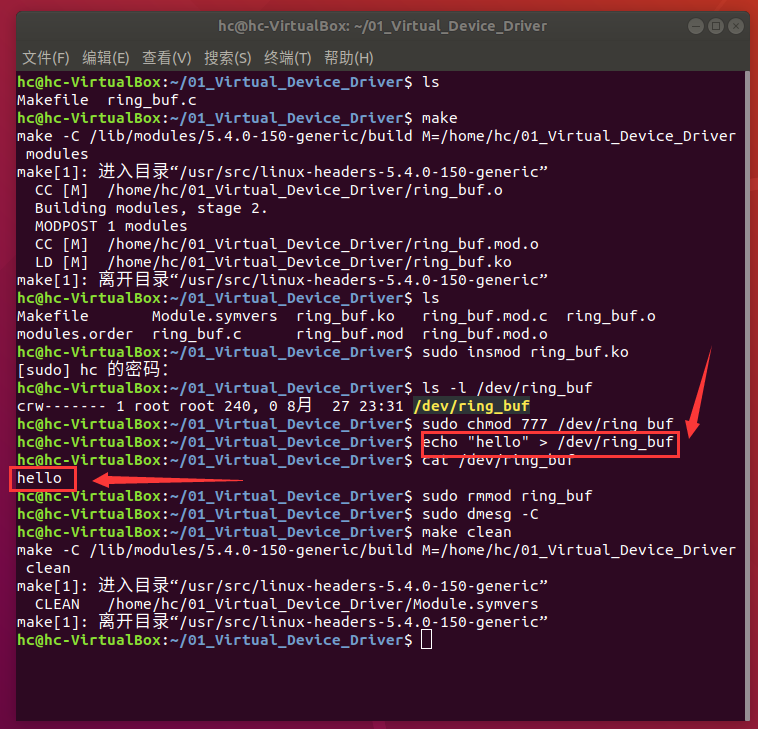

# 一：Linux驱动开发基本模板

直接用一个虚拟设备驱动，确立Linux驱动开发的基本模板。

我选择的虚拟设备是环形缓冲区，这个东西很常见，就不解释其原理了。

我用的是C语言。

## 1. 模板建立

文件名：ring_buf.c

```c
#include <linux/init.h>
#include <linux/module.h>
#include <linux/kernel.h>
#include <linux/fs.h>
#include <linux/uaccess.h>
#include <linux/slab.h>
#include <linux/mutex.h>
#include <linux/device.h>
#include <linux/cdev.h>

// 编写所涉及的函数
static int dev_open(struct inode *inodep, struct file *filep);
static int dev_release(struct inode *inodep, struct file *filep);
static ssize_t dev_read(struct file *filep, char *buffer, size_t len, loff_t *offset);
static ssize_t dev_write(struct file *filep, const char *buffer, size_t len, loff_t *offset);

// 文件操作符，通过这个，就可以像操作文件一样操作设备（把设备抽象成文件就是这么抽象的）
static struct file_operations fops = {
        .open = dev_open,
        .release = dev_release,
        .read = dev_read,
        .write = dev_write,
};

// 设备驱动模块初始化函数
static int __init dev_module_init(void);
// 设备驱动模块退出函数
static void __exit dev_module_exit(void);

// 指定模块初始化函数，这样内核加载模块时可以自动初始化设备模块
module_init(dev_module_init);
// 指定模块退出函数，这样内核卸载模块时可以自动退出设备模块
module_exit(dev_module_exit);

// 设备驱动相关信息，这里写了就可以查询文件信息得到
MODULE_LICENSE("GPL");
MODULE_AUTHOR("huangcheng");
MODULE_DESCRIPTION("A simple ring buffer driver");
MODULE_VERSION("0.1");

```

这就是一个最简单最抽象的内核驱动模块模板。

具体实现的函数就需要再行实现了。

```c
// 设备名
#define DEVICE_NAME "ring_buf"
// 设备类名（在/dev/文件夹中创建设备文件需要，这是为了归类设备的文件夹）
#define CLASS_NAME "VirtDev"

// 设备号，向内核注册驱动的时候获得的一个唯一ID，通过设备号可以找到这个设备
static int majorNumber;
// 设备类（用来将设备归类，在对应的/dev/ClassName文件夹下可以看到相应的设备）
static struct class* ring_bufferClass = NULL;
// 设备结构体（表示内核中的一个实际的设备，因为一个设备可能还有很多子设备，同一个设备号可能表示多个设备，设备结构体才是一一对应的）
static struct device* ring_bufferDevice = NULL;

// 实现设备功能所需的全局变量、数据结构等
static char *buffer;
static int read_pos = 0;
static int write_pos = 0;
static struct mutex buffer_mutex;

static int __init dev_module_init(void) {
    // 这个函数的主要作用就是向内核注册设备，，并且初始化设备所需的资源

    // 向内核注册字符设备（Linux分为字符设备和块设备两种），卸载设备的时候需要设备号
    majorNumber = register_chrdev(0, DEVICE_NAME, &fops);
    if (majorNumber < 0) {
        printk(KERN_ALERT "Failed to register a major number\n");
        return majorNumber;
    }
    printk(KERN_INFO "Registered correctly with major number %d\n", majorNumber);

    // 注册设备类
    ring_bufferClass = class_create(THIS_MODULE, CLASS_NAME);
    if (IS_ERR(ring_bufferClass)) {
        unregister_chrdev(majorNumber, DEVICE_NAME);
        printk(KERN_ALERT "Failed to register device class\n");
        return PTR_ERR(ring_bufferClass);
    }
    printk(KERN_INFO "Device class registered correctly\n");

    // 注册设备驱动
    ring_bufferDevice = device_create(ring_bufferClass, NULL, MKDEV(majorNumber, 0), NULL, DEVICE_NAME);
    if (IS_ERR(ring_bufferDevice)) {
        class_destroy(ring_bufferClass);
        unregister_chrdev(majorNumber, DEVICE_NAME);
        printk(KERN_ALERT "Failed to create the device\n");
        return PTR_ERR(ring_bufferDevice);
    }
    printk(KERN_INFO "Device class created correctly\n");

    // 初始化设备所需资源（这里是内存和互斥锁）
    buffer = kmalloc(BUFFER_SIZE, GFP_KERNEL);
    if (!buffer) {
        unregister_chrdev(majorNumber, DEVICE_NAME);
        printk(KERN_ALERT "Failed to allocate memory\n");
        return -ENOMEM;
    }
    mutex_init(&buffer_mutex);
    printk(KERN_INFO "Device initialized\n");

    return 0;
}

static void __exit dev_module_exit(void) {
    // 这个函数的主要作用是销毁资源，并从内核中删除设备注册信息

    // 销毁设备类，这样就从/dev/文件夹中删除了
    device_destroy(ring_bufferClass, MKDEV(majorNumber, 0));
    class_unregister(ring_bufferClass);
    class_destroy(ring_bufferClass);
    // 删除设备注册信息
    unregister_chrdev(majorNumber, DEVICE_NAME);

    // 销毁资源（这里是互斥锁和内存）
    mutex_destroy(&buffer_mutex);
    kfree(buffer);

    printk(KERN_INFO "Device unregistered\n");
}
```

这两个函数也比较模板化，这么做之后/dev/文件夹里面直接就有了设备文件，读写测试也就方便了。

真正需要根据设备手册编写的是下面这些。

```c
#define BUFFER_SIZE 0x1000

static int dev_open(struct inode *inodep, struct file *filep) {
    // 这里打开操作直接打印结果就行，能执行肯定已经打开了
    printk(KERN_INFO "my_ring_buffer: Device has been opened\n");
    return 0;
}

static int dev_release(struct inode *inodep, struct file *filep) {
    // 这个虚拟设备释放操作也不需要干什么，直接打印结果就是了
    printk(KERN_INFO "my_ring_buffer: Device successfully closed\n");
    return 0;
}

static ssize_t dev_read(struct file *filep, char *user_buffer, size_t len, loff_t *offset) {
    int bytes_read = 0;

    if (mutex_lock_interruptible(&buffer_mutex)) {
        return -ERESTARTSYS;
    }

    while (len && read_pos != write_pos) {
        if (put_user(buffer[read_pos], user_buffer++)) {
            mutex_unlock(&buffer_mutex);
            return -EFAULT;
        }
        read_pos = (read_pos + 1) % BUFFER_SIZE;
        len--;
        bytes_read++;
    }

    mutex_unlock(&buffer_mutex);

    return bytes_read;
}

static ssize_t dev_write(struct file *filep, const char *user_buffer, size_t len, loff_t *offset) {
    int bytes_written = 0;

    if (mutex_lock_interruptible(&buffer_mutex)) {
        return -ERESTARTSYS;
    }

    while (len && ((write_pos + 1) % BUFFER_SIZE) != read_pos) {
        get_user(buffer[write_pos], user_buffer++);
        write_pos = (write_pos + 1) % BUFFER_SIZE;
        len--;
        bytes_written++;
    }

    mutex_unlock(&buffer_mutex);

    return bytes_written ? bytes_written : -EFAULT;
}

```

驱动开发绝不能用CMake，这东西只能用于用户态程序开发，对于Linux驱动开发必须用Makefile

```makefile
# 指定内核版本
KERNEL_VERSION := $(shell uname -r)

# 指定内核构建目录
KERNELDIR := /lib/modules/$(KERNEL_VERSION)/build

# 当前目录
PWD := $(shell pwd)

# 内核模块目标
obj-m := ring_buf.o

# 默认目标
all:
	$(MAKE) -C $(KERNELDIR) M=$(PWD) modules

# 清理目标
clean:
	$(MAKE) -C $(KERNELDIR) M=$(PWD) clean

.PHONY: all clean

```

这是一个简单的makefile，可以用来编译内核模块了。


## 2. 编译运行

cd进入项目文件夹，直接

```bash
sudo insmod ring_buf.ko

```

这样就能完成加载驱动模块的操作

可以通过

```bash
ls -l /dev/ring_buf

```

来检验。

但是这种情况下可能不能直接读写，需要先改权限，我懒，直接777打满所有权限。

```bash
sudo chmod 777 /dev/ring_buf
```

测试的方式也很简单，直接用Linux命令读写

```bash
echo "hello" > /dev/ring_buf
cat /dev/ring_buf

```

还可以检查内核日志，printk就是打印到内核消息里面的

```bash
dmesg | tail

```

卸载内核模块和清理内核日志（建议同时进行）

```bash
sudo rmmod ring_buf
sudo dmesg -C

```


## 3. 实际运行效果

组合命令

```bash
make
sudo insmod ring_buf.ko
ls -l /dev/ring_buf
sudo chmod 777 /dev/ring_buf
echo "hello" > /dev/ring_buf
cat /dev/ring_buf
sudo rmmod ring_buf
sudo dmesg -C
make clean

```

执行结果：



整个过程

```bash
hc@hc-VirtualBox:~/01_Virtual_Device_Driver$ ls
Makefile  ring_buf.c
hc@hc-VirtualBox:~/01_Virtual_Device_Driver$ make
make -C /lib/modules/5.4.0-150-generic/build M=/home/hc/01_Virtual_Device_Driver modules
make[1]: 进入目录“/usr/src/linux-headers-5.4.0-150-generic”
  CC [M]  /home/hc/01_Virtual_Device_Driver/ring_buf.o
  Building modules, stage 2.
  MODPOST 1 modules
  CC [M]  /home/hc/01_Virtual_Device_Driver/ring_buf.mod.o
  LD [M]  /home/hc/01_Virtual_Device_Driver/ring_buf.ko
make[1]: 离开目录“/usr/src/linux-headers-5.4.0-150-generic”
hc@hc-VirtualBox:~/01_Virtual_Device_Driver$ ls
Makefile       Module.symvers  ring_buf.ko   ring_buf.mod.c  ring_buf.o
modules.order  ring_buf.c      ring_buf.mod  ring_buf.mod.o
hc@hc-VirtualBox:~/01_Virtual_Device_Driver$ sudo insmod ring_buf.ko
[sudo] hc 的密码： 
hc@hc-VirtualBox:~/01_Virtual_Device_Driver$ ls -l /dev/ring_buf
crw------- 1 root root 240, 0 8月  27 23:31 /dev/ring_buf
hc@hc-VirtualBox:~/01_Virtual_Device_Driver$ sudo chmod 777 /dev/ring_buf
hc@hc-VirtualBox:~/01_Virtual_Device_Driver$ echo "hello" > /dev/ring_buf
hc@hc-VirtualBox:~/01_Virtual_Device_Driver$ cat /dev/ring_buf
hello
hc@hc-VirtualBox:~/01_Virtual_Device_Driver$ sudo rmmod ring_buf
hc@hc-VirtualBox:~/01_Virtual_Device_Driver$ sudo dmesg -C
hc@hc-VirtualBox:~/01_Virtual_Device_Driver$ make clean
make -C /lib/modules/5.4.0-150-generic/build M=/home/hc/01_Virtual_Device_Driver clean
make[1]: 进入目录“/usr/src/linux-headers-5.4.0-150-generic”
  CLEAN   /home/hc/01_Virtual_Device_Driver/Module.symvers
make[1]: 离开目录“/usr/src/linux-headers-5.4.0-150-generic”

```

这就是Linux驱动开发的基本模板了。
