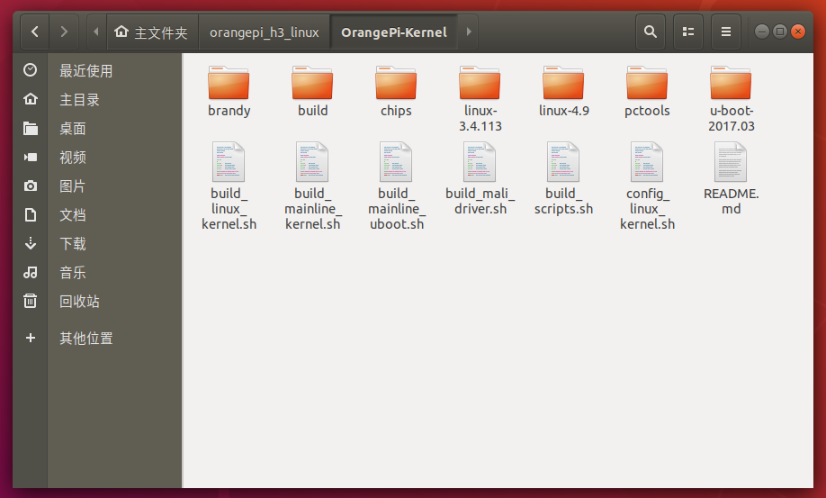
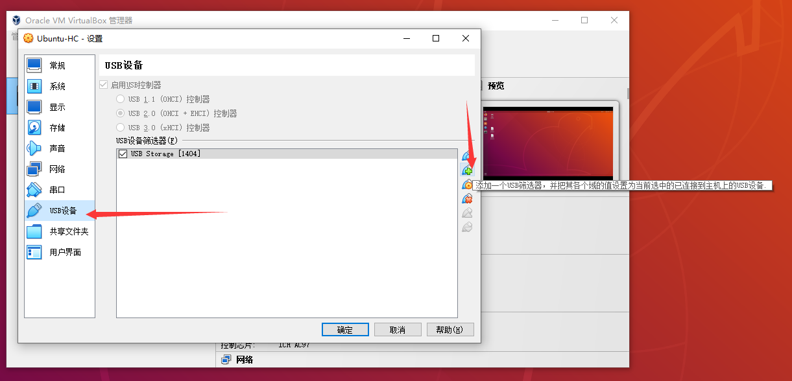
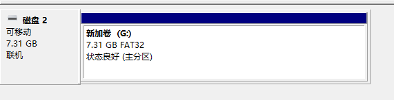
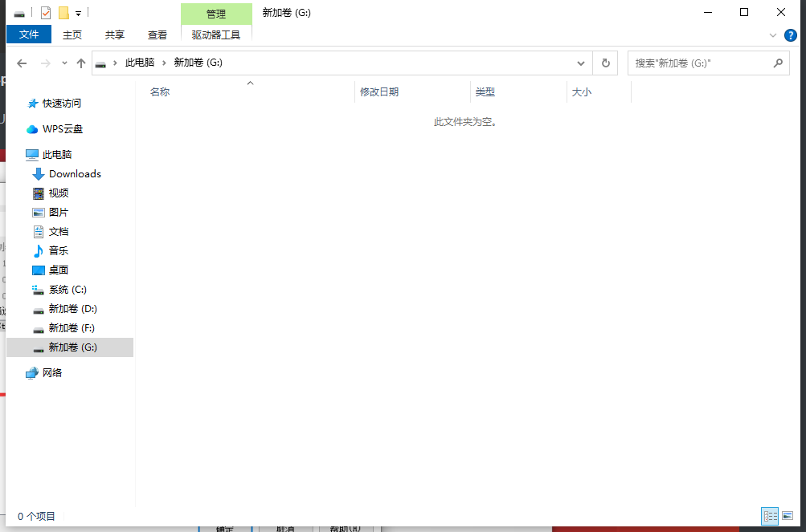
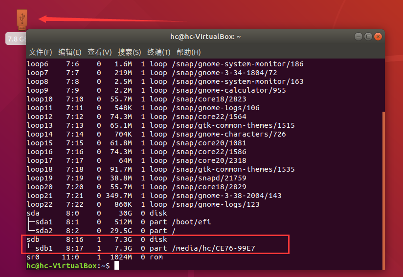
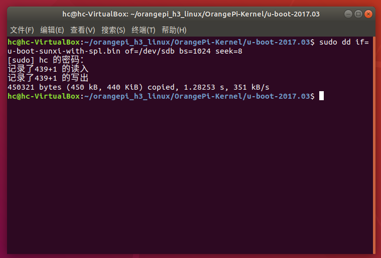
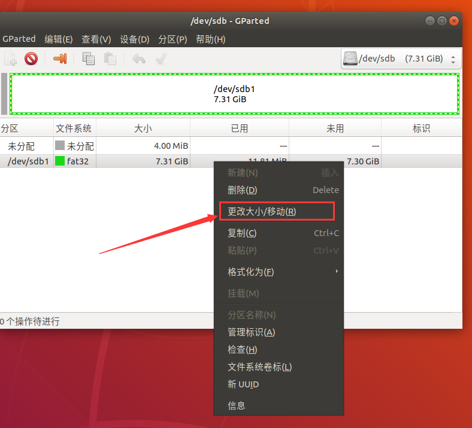
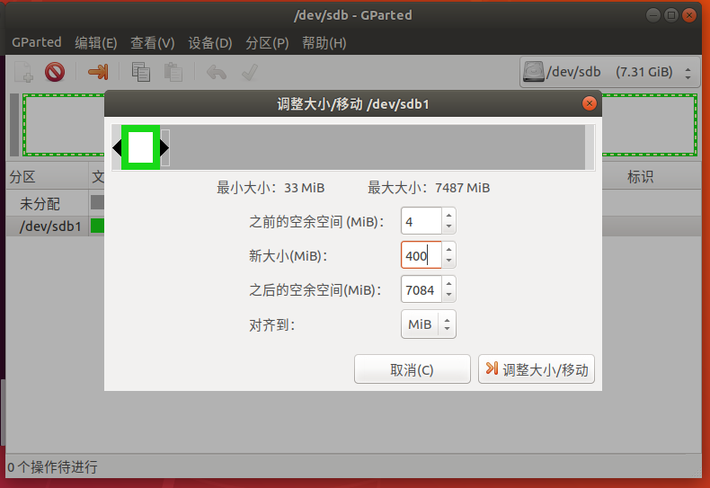
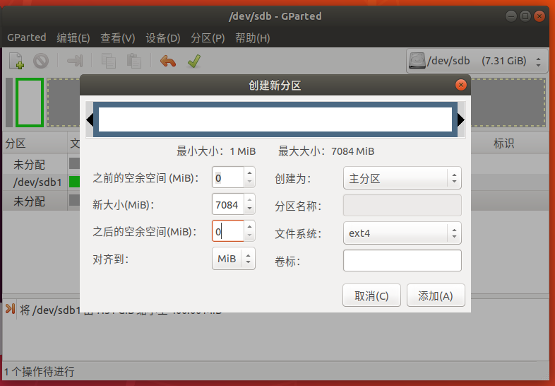
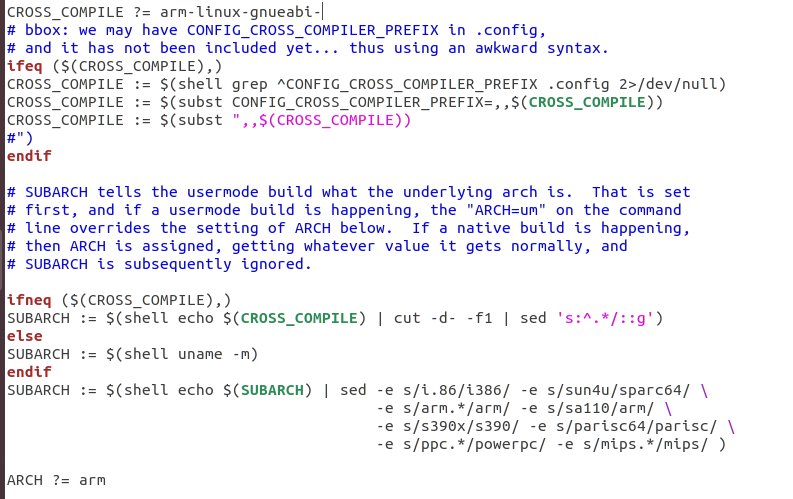

# 二：编译烧写Linux到开发板上并移植驱动


开发板型号：Orange Pi One（二手的，拼多多买的）。

TF卡：SanDisk 8GB（二手卖家送的，超过4GB就行，低于4GB可能不太够用）。

读卡器：我家旁边的中国移动营业厅买的，18元，被坑了，建议直接拼多多买。

电脑平台规格：

```
设备名称	PC-202302251334
处理器	11th Gen Intel(R) Core(TM) i7-11800H @ 2.30GHz   2.30 GHz
机带 RAM	16.0 GB (15.8 GB 可用)
设备 ID	6F265623-F058-48D9-9BCC-4D6190B95769
产品 ID	00328-10000-00001-AA406
系统类型	64 位操作系统, 基于 x64 的处理器
笔和触控	没有可用于此显示器的笔或触控输入

```

工具套装：VirtualBox虚拟机 + Ubuntu 18.04 LTS Desktop + 清华大学镜像源。

虚拟机分配资源：

```
CPU核心分配：4核心（我的CPU是8核心，看情况，分配得多编译效率越高）
内存分配：2048MB
显存分配：64MB（这个不太重要）
硬盘分配：30GB
启用I/O APIC
启用UTC
启用EFI
启用PAE/NX
启用嵌套分页
```

需要安装的软件包：

```bash
sudo apt update
sudo apt-get install python3-setuptools swig python3-dev python3-pip gcc-arm-none-eabi git build-essential
pip3 install importlib_resources

```

然后直接用git下载香橙派官方Linux源代码仓库，因为我的硬盘不够用，只能用下载体量小的，我下了他们做好的专供全志H3平台系列机器（Orange Pi One就是用的全志H3的SoC）的项目。

```bash
git clone https://github.com/orangepi-xunlong/orangepi_h3_linux.git

```

然后就可以开工了。

## 0. 一键搭建（不成功）

根据orangepi_h3_linux项目的readme：

> - **make rootfs **
>
> ```bash
> cd OrangePi-BuildLinux
> vim params.sh                                  #按照需求选择发行版等
> 
> example(例):
> #distro="precise"
> distro="xenial"
> #distro="utopic"
> #distro="vivid"
> #distro="wily"
> repo="http://ports.ubuntu.com/ubuntu-ports"    #需要请打开注释，不需要则注释
> 
> sudo ./create_image                            #在当前目录生成boot分区和rootfs分区
> ```

个人看法，params.sh里面的东西完全不用改，直接就能用了，它直接设置了用户名和密码都是orangepi，其他的更不用改了，干脆全都照官方做法来。

进入OrangePi-BuildLinux文件夹，直接

```bash
sudo ./create_image opi-one

```

这不是单纯的一个根文件系统，而是相当于从头到尾制造一个全新的Linux发行版，因此编译要花很长时间，没办法只能等，我的配置在20分钟以内完工。


```bash
hc@hc-VirtualBox:~/orangepi_h3_linux/OrangePi-BuildLinux$ sudo ./create_image opi-one

2024年 08月 31日 星期六 00:53:19 CST
=======================================================
Creating Ubuntu/Debian SD Card instalation for OrangePI
=======================================================

Creating root filesistem in local directory linux-xenial...

DEBOOTSTRAP, FIRST STAGE
OK.                        
Creating "sources.list"

OK.                        
DEBOOTSTRAP, SECOND-STAGE FINISHED.

/second-stage: line 254: warning: setlocale: LC_ALL: cannot change locale (en_US
=======================
Updating & upgrading...
OK.                        
OK.                        
Installing essential packages...
OK.                        

*** Installing Ubuntu xenial ***

Installing base packages...
OK.                        
Installing language pack...
OK.                        
Installing more packages...
OK.                        
Configuring, please wait...
CREATING root PASSWORD...
ADDING USER...

Instalation finished.

cp: cannot stat 'update_boot.sh': No such file or directory

Creating "fstab"

Sat Aug 31 01:15:44 CST 2024

************************************************************
Instalation finished.

Copy files from boot-xenial to SD Card boot partition
  e.g.  cp boot-xenial/* <path_to_sdcard_boot_mount>
  and rsync linux-xenial to SD Card ext4 partition.
  e.g. sudo rsync -r -t -p -o -g -x -v --progress --delete -l -H -D --numeric-ids -s /home/hc/orangepi_h3_linux/OrangePi-BuildLinux/linux-xenial/ <path_to_sdcard_ext4_mount>/

Or create SDCard image running:
  sudo ./image_from_dir linux-xenial <DEVICE|IMAGE>

You can chroot into "linux-xenial" to make additional changes:
  sudo chroot linux-xenial /usr/bin/qemu-arm-static -cpu cortex-a9 /bin/bash


************************************************************
* AFTER BOOTING:                                           *
* -------------------------------------------------------- *
* To RESIZE LINUX partition to fill sd card run:           *
*   sudo fs_resize                                         *
* -------------------------------------------------------- *
* To install to EMMC run:                                  *
*   sudo install_to_emmc                                   *
* -------------------------------------------------------- *
* To install desktop run:                                  *
*   sudo install_lxde_desktop                              *
*   or, for better-looking (wily&vivid&jessie)             *
*   sudo install_mate_desktop                              *
*   DON'T FORGET TO RESIZE SD CARD IF NECESSARY FIRST      *
* -------------------------------------------------------- *
* To configure your local settings use:                    *
*   sudo dpkg-reconfigure tzdata                           *
*   sudo dpkg-reconfigure keyboard-configuration           *
*   sudo dpkg-reconfigure console-setup                    *
*     # change your system's locale entries by modifying   *
*     # the file /etc/default/locale (e.g. en_US.UTF-8)    *
*     # then run:                                          *
*   sudo locale-gen <your_locale> (e.g en_US.UTF-8)        *
*   sudo dpkg-reconfigure locales                          *
************************************************************

Sat Aug 31 01:15:44 CST 2024

```

这是整个过程。

然后就简单了，按照提示，可以直接写：

```bash
sudo umount /dev/sdb1
sudo ./image_from_dir linux-xenial /dev/sdb

```

注意，要先卸载TF卡上的所有分区，这个脚本会重新分区。

结果：

```bash
hc@hc-VirtualBox:~/orangepi_h3_linux/OrangePi-BuildLinux$ sudo ./image_from_dir linux-xenial /dev/sdb

2024年 08月 31日 星期六 01:18:15 CST
===================================================
Creating Ubuntu/Debian SD Card (image) for OrangePI
===================================================

480964
Creating filesystem on block device /dev/sdb ...
Creating bootable SD card /dev/sdb, please wait ...


Creating new filesystem on /dev/sdb...
  New filesystem created on /dev/sdb.

Partitioning /dev/sdb...
  Creating boot & linux partitions
  OK.

Formating fat partition ...
  fat partition formated.
Formating linux partition (ext4), please wait ...
  linux partition formated.

Instaling u-boot to /dev/sdb ...
U-boot installed to /dev/sdb.

==== Info ====
    from: linux-xenial
      to: /dev/sdb
   btrfs: no
dir size: 469 MB
img size: 1053 MB
==============


Mounting SD Card partitions...
FAT partitions mounted to _fatdir
linux partition mounted to _extdir

Copying file system to image ...


Number of files: 18,115 (reg: 14,288, dir: 1,837, link: 1,990)
Number of created files: 18,114 (reg: 14,288, dir: 1,836, link: 1,990)
Number of deleted files: 1 (dir: 1)
Number of regular files transferred: 14,283
Total file size: 453,344,366 bytes
Total transferred file size: 448,784,700 bytes
Literal data: 448,784,700 bytes
Matched data: 0 bytes
File list size: 327,642
File list generation time: 0.001 seconds
File list transfer time: 0.000 seconds
Total bytes sent: 449,952,438
Total bytes received: 288,377

sent 449,952,438 bytes  received 288,377 bytes  2,704,149.04 bytes/sec
total size is 453,344,366  speedup is 1.01
Creating "fstab"

sync, please wait ...

Sat Aug 31 01:23:51 CST 2024

*********************
SDCard image created.
*********************

```

分区完成之后，TF卡被分了两个区，分别是BOOT和linux。这是lsblk的结果。

```bash
sdb      8:16   1   7.3G  0 disk 
├─sdb1   8:17   1    64M  0 part /media/hc/BOOT
└─sdb2   8:18   1   968M  0 part /media/hc/linux

```

可以直接上机测试了。但是我测试没成功，也不知道为什么？这个一键脚本做出来的应该是Ubuntu系统。


## 1. u-boot

进入orangepi_h3_linux里面的OrangePi-Kernel文件夹，可以看到有这些文件。



进入u-boot-2017.03，命令行方式是：

（从刚刚clone的目录起始）

```bash
cd orangepi_h3_linux/OrangePi-Kernel/u-boot-2017.03

```

然后就可以开始编译u-boot了，命令如下。

```bash
make mrproper
make orangepi_one_defconfig
make CROSS_COMPILE=arm-none-eabi-

```

编译完成，列出文件能看到这些。

```bash
hc@hc-VirtualBox:~/orangepi_h3_linux/OrangePi-Kernel/u-boot-2017.03$ ls
api        dts          post             u-boot.cfg.configs
arch       examples     README           u-boot.dtb
board      fs           scripts          u-boot-dtb.bin
build      include      snapshot.commit  u-boot-dtb.img
cmd        Kbuild       spl              u-boot.img
common     Kconfig      System.map       u-boot.lds
config.mk  lib          test             u-boot.map
configs    Licenses     tools            u-boot-nodtb.bin
disk       MAINTAINERS  u-boot           u-boot.srec
doc        Makefile     u-boot.bin       u-boot-sunxi-with-spl.bin
drivers    net          u-boot.cfg       u-boot.sym

```

需要的是 **u-boot-sunxi-with-spl.bin** 。需要烧写进入TF卡里面。

把TF卡插上读卡器，然后插上USB口，如果之前没设置过，需要在VirtualBox里面设置，添加设备，让虚拟机能够读取这张TF卡。然后拔出读卡器重新插USB口就行了。



一般来说，新的TF卡都格式化了FAT32文件系统，也只有一个分区，我只按照这个前提情况进行，如果不是，在Windows里面用 `diskmgmt` 工具删分区，重新格式化就行了。





就像这样，什么都没有，全新的状态。然后就上虚拟机了。

输入命令，列出所有块设备（TF卡上读卡器之后属于USB存储设备，Linux将这种设备分类为块设备）。

```bash
lsblk

```



现在就能看到TF卡了，直接烧写u-boot。

这里说明一下，现代操作系统格式化存储设备的文件系统的时候，往往采取1MB对齐的方式，存储设备最开头的1MB属于保留空间，第一个扇区（512字节）放了MBR之后，剩下的就保留了，而按照香橙派的设置，u-boot是刷在8KB处起始，u-boot大概450KB大小，所以保留空间完全能放得下不影响。

进入之前编译u-boot的目录，就可以烧写到设备中了。

```bash
sudo dd if=u-boot-sunxi-with-spl.bin of=/dev/sdb bs=1024 seek=8

```

这样就行了。



接下来可以插卡上Orange Pi One机子，看看u-boot能不能正常运行了，我试过u-boot是没问题的。


## 2. Linux内核

Orange Pi 官方这个仓库里面把编译工具链也给放进去了，省了一大麻烦。Linux 3.4.113这个内核版本太老了，需要gcc 4才能正常编译，连gcc 5都不行，Ubuntu的清华镜像源现在版本最低都是gcc 5了，一言难尽。而且这东西还是一键操作，都不用配置了。

但是很奇怪，Linux 3.4.113这个内核版本编译出来上机用不了。

给Linux 3.4.113的内核编译命令，如果可以的话后面再尝试解决这个问题。

### 2.1 linux-3.4.113（不能用不推荐）

编译烧写完u-boot，还在u-boot-2017.03目录里面，直接跳转上级，回到OrangePi-Kernel目录。

```bash
cd ../
sudo ./build_linux_kernel.sh clean
sudo ./build_linux_kernel.sh one

```

连配置都不用，Orange Pi官方都帮我们配好了，等待编译完成就行了。

这样就好了：

```bash
hc@hc-VirtualBox:~/orangepi_h3_linux/OrangePi-Kernel$ sudo ./build_linux_kernel.sh clean
Cleaning...
***OK***
hc@hc-VirtualBox:~/orangepi_h3_linux/OrangePi-Kernel$ sudo ./build_linux_kernel.sh one
Building kernel for OPI-one () ...
  Configuring ...
  Building kernel & modules ...
  Exporting modules ...
  Exporting firmware ...
  Building mali drivers...
  mali build OK.
***OK***

```

整个构建完成可能需要一些时间，我自己实测是大概需要六分钟左右才能建完。

编译出来的内核文件在 `linux-3.4.113/arch/arm/boot` 文件夹下面：

```bash
hc@hc-VirtualBox:~/orangepi_h3_linux/OrangePi-Kernel/linux-3.4.113$ cd arch/arm/boot
hc@hc-VirtualBox:~/orangepi_h3_linux/OrangePi-Kernel/linux-3.4.113/arch/arm/boot$ ls
bootp  compressed  dts  Image  install.sh  Makefile  uImage  zImage

```

Image就是最原始的镜像，zImage是压缩的Image（z代表的就是zip），uImage是zImage开头加上了64字节的信息，u-boot可以直接加载uImage。

### 2.2 linux-4.9（推荐）

我自己用的是Linux 4.9的，实测可用，我也推荐用这个。

从OrangePi-Kernel目录开始，进入Linux-4.9内核，直接用Allwinner H3（不知道为什么Linux内核里面它的型号名是sun8iw7p1）的默认主线配置编译。

个人觉得编译 u-boot 用的 gcc-arm-none-eabi 工具链比 Orange Pi 官方仓库自带的工具链效果好还快，不过不推荐使用，因为后面编译根文件系统和驱动都要用标准C库，这个裸机编译工具链没有标准C库。

同样的工具链能保证编译出来的各种信息尽可能一致，尽量减少各种奇奇怪怪的问题。

所以先装一个最标准的带C库的工具链吧，这个在Ubuntu 18.04 LTS的主线上目前是gcc 7版本的。

```bash
sudo apt-get install gcc-arm-linux-gnueabi

```

然后直接开始编译linux-4.9内核。

```bash
cd linux-4.9
sudo make mrproper
sudo make sun8iw7p1_mainline_defconfig
sudo make ARCH=arm CROSS_COMPILE=arm-linux-gnueabi-

```

建议不要用OrangePi-Kernel目录下的build_mainline_kernel脚本，它还需要自己配置，就很麻烦。

按照我给虚拟机的资源配置，十二分钟以内能完成编译，个人实测平均十一分钟，如果使用 gcc-arm-none-eabi 工具链，可以缩短到十分钟以内。

编译出来的内核文件在 `linux-4.9/arch/arm/boot` 文件夹下面，我们需要的就是 **zImage** ：

```bash
hc@hc-VirtualBox:~/orangepi_h3_linux/OrangePi-Kernel/linux-4.9/arch/arm/boot$ lsbootp  compressed  dts  Image  install.sh  Makefile  zImage

```

至于设备树，在dts文件夹里面。设备树文件名为：**sun8i-h3-orangepi-one.dtb**

现在是在 linux-4.9/arch/arm/boot 目录，设备树文件的位置就是

```bash
ls -l ./dts/sun8i-h3-orangepi-one.dtb
```


### 2.3 上机测试

把设备树文件、zImage放到TF卡唯一的分区里面。

TF卡上真机，连串口通信，测试Linux系统能不能用。

构建过程参考：

[香橙派全志H3烧入U-boot和Linux内核以及配置_香橙派3刷linux-CSDN博客](https://blog.csdn.net/qq_40937426/article/details/107544822?spm=1001.2014.3001.5506)

[香橙派One（全志H3芯片）编译烧写U-boot、Linux内核zImage、dtb-CSDN博客](https://blog.csdn.net/weixin_39954922/article/details/130984241)


上电之后按空格中断自动启动操作（现在也启动不了，白白浪费时间），然后开始输入命令。

```bash
fatload mmc 0:1 0x43000000 sun8i-h3-orangepi-one.dtb
fatload mmc 0:1 0x42000000 zImage
bootz 0x42000000 - 0x43000000

```

解释一下，0x43000000和0x42000000是u-boot定的，看环境变量就知道了。

```bash
=> printenv 
// 其他东西太多了，挑重点
fdt_addr_r=0x43000000
fdtcontroladdr=59f37028
fdtfile=sun8i-h3-orangepi-one.dtb
kernel_addr_r=0x42000000
load_efi_dtb=load ${devtype} ${devnum}:${distro_bootpart} ${fdt_addr_r} ${prefix}${efi_fdtfile}

```

只要出现这个，就说明Linux内核能启动，能从设备树读取信息：

```bash
Starting kernel ...
```

但是不能真正进入系统，主要原因是还没有做根文件系统，等做好了根文件系统就能进入Linux系统了。

可以设置一下环境变量，之后让u-boot自动启动，不用手打了。

在u-boot中，输入

```bash
setenv bootargs console=ttyS0,115200 root=/dev/mmcblk0p2 rootwait panic=10 rw
setenv bootcmd 'fatload mmc 0:1 0x42000000 zImage; fatload mmc 0:1 0x43000000 sun8i-h3-orangepi-one.dtb; bootz 0x42000000 - 0x43000000'
saveenv

```

这样，下次u-boot就能自动帮我们载入内核了。

解释参数意义：

```
bootargs:  u-boot启动内核的时候传递给内核的参数

console=ttyS0,115200 : 控制台重定向到ttyS0设备（即uart0），串口波特率为115200

root=/dev/mmcblk0p2 rootwait : 这是指定根文件系统的位置
- mmcblk:  表示设备类型为mmc块设备
- 0:       指定了设备类型（0 表示 SD卡，1 表示 EMMC）
- p2:      指定分区，这里表示第2个分区（现在只有一个分区，所以还没有，还需要修改）
- rootwait:   表示等待 mmc 设备初始化完成以后再挂载

panic=10:  当内核发生 panic 时，内核将会等待 10 秒钟，然后自动重新启动系统。

rw:        指定文件系统的权限可读可写

bootm 0x42000000 - 0x43000000: 三个参数分别是内核在内存中的地址，根文件系统在内存中的地址（因为根文件系统用了bootargs方式加载，因此留空），设备树在内存中的地址
```


## 3. 第二个分区

可以给TF卡分第二个区了，没有第二个区没法进行接下来的制作和烧写根文件系统。

最简单的办法就是格盘重分，重新烧写u-boot，再重复一遍上面的设置过程，但是我不想重来一遍，就用Linux来重分一下分区吧。

在Ubuntu里面，因为我的分区把整个TF卡都占据了，要缩小分区，用Linux里面的一个工具。卸载分区好进行后续的操作。

```bash
sudo umount /dev/sdb1
sudo apt install gparted
sudo gparted

```

这东西是图形化操作的。



调整，分区1只留400MB就行了。



然后创建第二个分区就行了。



然后点击最上面的绿色勾，应用全部操作，就行了。

这样就建立了第二个分区，而且还是Linux系统的ext4文件系统格式（其实用FAT32也没什么，用FAT32的兼容性还更好，反正后面还要改）。


## 4. 根文件系统

编译根文件系统用前面安装的 gcc-arm-linux-gnueabi 工具链，和内核、驱动用的工具链保持一致。

我用的根文件系统是最常见的busybox。

```bash
wget https://busybox.net/downloads/busybox-1.33.1.tar.bz2
tar -xjf busybox-1.33.1.tar.bz2
cd busybox-1.33.1

```

下载解压进目录。

改一下busybox的makefile

```bash
sudo vi ./Makefile

```



CROSS_COMPILE在第164行。

busybox和Linux类似，可以菜单配置。

```bash
make menuconfig

```

我偷懒直接默认配置了。

```bash
make defconfig

```

保存配置就行了。

然后直接编译安装到TF卡的第二个分区。以防万一，给第二个分区重新格式化一下，为ext4格式（不格盘也没什么，推荐都再格一遍，建议ext4文件系统格式）。

```bash
sudo umount /dev/sdb2
sudo mkfs.ext4 /dev/sdb2

```

我不推荐用mount命令重新挂载，我觉得直接拔出重插USB更方便。

用 lsblk 命令确定一下设备挂载点，要安装根文件系统到第二个分区。

```bash
sdb      8:16   1   7.3G  0 disk 
├─sdb1   8:17   1   400M  0 part /media/hc/93B2-3F19
└─sdb2   8:18   1   6.9G  0 part /media/hc/3a71c169-cc2c-49ed-aed9-f9daa380f693

```

那么挂载点就是

```bash
/media/hc/3a71c169-cc2c-49ed-aed9-f9daa380f693
```

参考：[香橙派全志H3烧录Uboot，远程加载zImage，dtb，rootfs_全志h3 uboot-CSDN博客](https://blog.csdn.net/qq_42039294/article/details/125067437)

还是要开菜单配置修改一些东西，具体修改如下：

```
-> Settings 
    -> Build static binary (no shared libs) // 编译为静态库，需要选上，动态库状态下没法用

```

然后编译，安装到第二个分区。

```bash
make -j4
sudo make CONFIG_PREFIX=/media/hc/3a71c169-cc2c-49ed-aed9-f9daa380f693 install
ls /media/hc/3a71c169-cc2c-49ed-aed9-f9daa380f693

```

结果：

```bash
hc@hc-VirtualBox:~/busybox-1.33.1$ sudo make CONFIG_PREFIX=/media/hc/3a71c169-cc2c-49ed-aed9-f9daa380f693 install
  # 太长不看
  /media/hc/3a71c169-cc2c-49ed-aed9-f9daa380f693//usr/sbin/ubirsvol -> ../../bin/busybox
  /media/hc/3a71c169-cc2c-49ed-aed9-f9daa380f693//usr/sbin/ubiupdatevol -> ../../bin/busybox
  /media/hc/3a71c169-cc2c-49ed-aed9-f9daa380f693//usr/sbin/udhcpd -> ../../bin/busybox


--------------------------------------------------
You will probably need to make your busybox binary
setuid root to ensure all configured applets will
work properly.
--------------------------------------------------
hc@hc-VirtualBox:~/busybox-1.33.1$ ls /media/hc/3a71c169-cc2c-49ed-aed9-f9daa380f693
bin  linuxrc  lost+found  sbin  usr

```

说明安装成功了。

接下来就要创建其他所需的目录了。

```bash
cd /media/hc/3a71c169-cc2c-49ed-aed9-f9daa380f693
sudo mkdir -p ./etc
sudo mkdir -p ./dev
sudo mkdir -p ./proc
sudo mkdir -p ./sys
sudo mkdir -p ./tmp

```

为了让系统可以正常工作，要创建几个必须的设备节点

```bash
sudo mknod ./dev/console c 5 1
sudo mknod ./dev/null c 1 3

```

还要配置fstab，确保系统在启动时能够正确挂载必要的文件系统

```bash
sudo vi ./etc/fstab

```

fstab里面写这些内容

```bash
/dev/mmcblk0p2  /       ext4    defaults    1   1
proc            /proc   proc    defaults    0   0
sysfs           /sys    sysfs   defaults    0   0
tmpfs           /tmp    tmpfs   defaults    0   0

```

保存退出即可。

然后是创建初始化脚本。

```bash
sudo vi ./init

```

内容为：

```bash
#!/bin/sh

mount -t proc proc /proc
mount -t sysfs sys /sys
mount -t tmpfs tmpfs /tmp

# 启动 shell
/bin/sh

```

保存退出即可。要给脚本执行权限。

```bash
sudo chmod +x ./init

```

再用BusyBox的安装脚本创建所有需要的符号链接。

```bash
sudo busybox --install -s bin

```

如果需要的话还可以设置账户密码：

```bash
sudo vi ./etc/passwd

```

添加内容：

```bash
root:x:0:0:root:/root:/bin/sh

```

就创建了root账户、密码也是root。我偷懒，没设置，我觉得没必要。

然后弹出TF卡，上机子，可以直接用了。


## 5. 启动系统

插TF卡上板子，连接串口通信，直接上电就行了。

全部输出过程如下，直接说结论，成功进入Linux系统了：

```bash
U-Boot 2017.03 (Aug 31 2024 - 01:39:47 +0800) Allwinner Technology

CPU:   Allwinner H3 (SUN8I 1680)
Model: Xunlong Orange Pi One
DRAM:  512 MiB
MMC:   SUNXI SD/MMC: 0
In:    serial
Out:   serial
Err:   serial
Net:   phy interface0
eth0: ethernet@1c30000
Hit any key to stop autoboot:  0 
reading zImage
3559632 bytes read in 193 ms (17.6 MiB/s)
reading sun8i-h3-orangepi-one.dtb
18659 bytes read in 26 ms (700.2 KiB/s)
## Flattened Device Tree blob at 43000000
   Booting using the fdt blob at 0x43000000
   Loading Device Tree to 49ff8000, end 49fff8e2 ... OK

Starting kernel ...

[    0.000000] Booting Linux on physical CPU 0x0
[    0.000000] Linux version 4.9.0-rc1 (root@hc-VirtualBox) (gcc version 6.3.1 20170620 (15:6.3.1+svn253039-1build1) ) #1 SMP Sat Aug 31 23:58:59 CST 2024
[    0.000000] CPU: ARMv7 Processor [410fc075] revision 5 (ARMv7), cr=10c5387d
[    0.000000] CPU: div instructions available: patching division code
[    0.000000] CPU: PIPT / VIPT nonaliasing data cache, VIPT aliasing instruction cache
[    0.000000] OF: fdt:Machine model: Xunlong Orange Pi One
[    0.000000] cma: Reserved 64 MiB at 0x5c000000
[    0.000000] Memory policy: Data cache writealloc
[    0.000000] On node 0 totalpages: 131072
[    0.000000] free_area_init_node: node 0, pgdat c09460c0, node_mem_map dbb59000
[    0.000000]   Normal zone: 1152 pages used for memmap
[    0.000000]   Normal zone: 0 pages reserved
[    0.000000]   Normal zone: 131072 pages, LIFO batch:31
[    0.000000] percpu: Embedded 14 pages/cpu @dbb0f000 s25292 r8192 d23860 u57344
[    0.000000] pcpu-alloc: s25292 r8192 d23860 u57344 alloc=14*4096
[    0.000000] pcpu-alloc: [0] 0 [0] 1 [0] 2 [0] 3 
[    0.000000] Built 1 zonelists in Zone order, mobility grouping on.  Total pages: 129920
[    0.000000] Kernel command line: earlyprintk=ttyS0,115200 loglevel=8 root=/dev/mmcblk0p2 rootwait rootfstype=ext4 video=HDMI-A-1:1920x1080-32@60 console=tty1 console=ttyS0,115200
[    0.000000] PID hash table entries: 2048 (order: 1, 8192 bytes)
[    0.000000] Dentry cache hash table entries: 65536 (order: 6, 262144 bytes)
[    0.000000] Inode-cache hash table entries: 32768 (order: 5, 131072 bytes)
[    0.000000] Memory: 444520K/524288K available (5120K kernel code, 283K rwdata, 1236K rodata, 1024K init, 269K bss, 14232K reserved, 65536K cma-reserved, 0K highmem)
[    0.000000] Virtual kernel memory layout:
[    0.000000]     vector  : 0xffff0000 - 0xffff1000   (   4 kB)
[    0.000000]     fixmap  : 0xffc00000 - 0xfff00000   (3072 kB)
[    0.000000]     vmalloc : 0xe0800000 - 0xff800000   ( 496 MB)
[    0.000000]     lowmem  : 0xc0000000 - 0xe0000000   ( 512 MB)
[    0.000000]     pkmap   : 0xbfe00000 - 0xc0000000   (   2 MB)
[    0.000000]     modules : 0xbf000000 - 0xbfe00000   (  14 MB)
[    0.000000]       .text : 0xc0008000 - 0xc0600000   (6112 kB)
[    0.000000]       .init : 0xc0800000 - 0xc0900000   (1024 kB)
[    0.000000]       .data : 0xc0900000 - 0xc0946cc0   ( 284 kB)
[    0.000000]        .bss : 0xc0948000 - 0xc098b50c   ( 270 kB)
[    0.000000] SLUB: HWalign=64, Order=0-3, MinObjects=0, CPUs=4, Nodes=1
[    0.000000] Hierarchical RCU implementation.
[    0.000000] 	Build-time adjustment of leaf fanout to 32.
[    0.000000] 	RCU restricting CPUs from NR_CPUS=8 to nr_cpu_ids=4.
[    0.000000] RCU: Adjusting geometry for rcu_fanout_leaf=32, nr_cpu_ids=4
[    0.000000] NR_IRQS:16 nr_irqs:16 16
[    0.000000] arm_arch_timer: Architected cp15 timer(s) running at 24.00MHz (virt).
[    0.000000] clocksource: arch_sys_counter: mask: 0xffffffffffffff max_cycles: 0x588fe9dc0, max_idle_ns: 440795202592 ns
[    0.000006] sched_clock: 56 bits at 24MHz, resolution 41ns, wraps every 4398046511097ns
[    0.000016] Switching to timer-based delay loop, resolution 41ns
[    0.000171] clocksource: timer: mask: 0xffffffff max_cycles: 0xffffffff, max_idle_ns: 79635851949 ns
[    0.000391] Console: colour dummy device 80x30
[    0.000935] console [tty1] enabled
[    0.000965] Calibrating delay loop (skipped), value calculated using timer frequency.. 48.00 BogoMIPS (lpj=240000)
[    0.001000] pid_max: default: 32768 minimum: 301
[    0.001103] Security Framework initialized
[    0.001124] Yama: becoming mindful.
[    0.001166] AppArmor: AppArmor disabled by boot time parameter
[    0.001217] Mount-cache hash table entries: 1024 (order: 0, 4096 bytes)
[    0.001239] Mountpoint-cache hash table entries: 1024 (order: 0, 4096 bytes)
[    0.001904] CPU: Testing write buffer coherency: ok
[    0.002286] CPU0: update cpu_capacity 1024
[    0.002313] CPU0: thread -1, cpu 0, socket 0, mpidr 80000000
[    0.002351] Setting up static identity map for 0x40100000 - 0x40100058
[    0.004508] Brought up 1 CPUs
[    0.004542] SMP: Total of 1 processors activated (48.00 BogoMIPS).
[    0.004560] CPU: All CPU(s) started in SVC mode.
[    0.005288] devtmpfs: initialized
[    0.010139] VFP support v0.3: implementor 41 architecture 2 part 30 variant 7 rev 5
[    0.010402] clocksource: jiffies: mask: 0xffffffff max_cycles: 0xffffffff, max_idle_ns: 19112604462750000 ns
[    0.012482] pinctrl core: initialized pinctrl subsystem
[    0.013303] NET: Registered protocol family 16
[    0.014214] DMA: preallocated 256 KiB pool for atomic coherent allocations
[    0.015242] hw-breakpoint: found 5 (+1 reserved) breakpoint and 4 watchpoint registers.
[    0.015274] hw-breakpoint: maximum watchpoint size is 8 bytes.
[    0.026286] reg-fixed-voltage usb0-vbus: could not find pctldev for node /soc/pinctrl@01f02c00/usb0_vbus_pin@0, deferring probe
[    0.027200] SCSI subsystem initialized
[    0.027330] usbcore: registered new interface driver usbfs
[    0.027399] usbcore: registered new interface driver hub
[    0.027487] usbcore: registered new device driver usb
[    0.028397] NetLabel: Initializing
[    0.028421] NetLabel:  domain hash size = 128
[    0.028437] NetLabel:  protocols = UNLABELED CIPSOv4
[    0.028505] NetLabel:  unlabeled traffic allowed by default
[    0.029055] clocksource: Switched to clocksource arch_sys_counter
[    0.037931] NET: Registered protocol family 2
[    0.038494] TCP established hash table entries: 4096 (order: 2, 16384 bytes)
[    0.038561] TCP bind hash table entries: 4096 (order: 3, 32768 bytes)
[    0.038635] TCP: Hash tables configured (established 4096 bind 4096)
[    0.038693] UDP hash table entries: 256 (order: 1, 8192 bytes)
[    0.038738] UDP-Lite hash table entries: 256 (order: 1, 8192 bytes)
[    0.038916] NET: Registered protocol family 1
[    0.040526] futex hash table entries: 1024 (order: 4, 65536 bytes)
[    0.040678] audit: initializing netlink subsys (disabled)
[    0.040746] audit: type=2000 audit(0.020:1): initialized
[    0.041368] workingset: timestamp_bits=14 max_order=17 bucket_order=3
[    0.053181] Block layer SCSI generic (bsg) driver version 0.4 loaded (major 251)
[    0.053226] io scheduler noop registered
[    0.053243] io scheduler deadline registered
[    0.053436] io scheduler cfq registered (default)
[    0.053634] sun4i-usb-phy 1c19400.phy: could not find pctldev for node /soc/pinctrl@01c20800/usb0_id_detect_pin@0, deferring probe
[    0.057597] sun8i-h3-pinctrl 1c20800.pinctrl: initialized sunXi PIO driver
[    0.059438] sun8i-h3-r-pinctrl 1f02c00.pinctrl: initialized sunXi PIO driver
[    0.117268] Serial: 8250/16550 driver, 1 ports, IRQ sharing disabled
[    0.118576] console [ttyS0] disabled
[    0.138793] 1c28000.serial: ttyS0 at MMIO 0x1c28000 (irq = 35, base_baud = 1500000) is a U6_16550A
[    0.748680] console [ttyS0] enabled
[    0.752742] [drm] Initialized
[    0.765856] brd: module loaded
[    0.769263] ehci_hcd: USB 2.0 'Enhanced' Host Controller (EHCI) Driver
[    0.775798] ehci-platform: EHCI generic platform driver
[    0.781384] usbcore: registered new interface driver usb-storage
[    0.787759] mousedev: PS/2 mouse device common for all mice
[    0.794054] sun6i-rtc 1f00000.rtc: rtc core: registered rtc-sun6i as rtc0
[    0.800891] sun6i-rtc 1f00000.rtc: RTC enabled
[    0.805771] thermal thermal_zone0: failed to read out thermal zone (-16)
[    0.813179] device-mapper: ioctl: 4.35.0-ioctl (2016-06-23) initialised: dm-devel@redhat.com
[    0.822893] sunxi-mmc 1c0f000.mmc: Got CD GPIO
[    0.879079] sunxi-mmc 1c0f000.mmc: base:0xe08b0000 irq:24
[    0.885197] usbcore: registered new interface driver usbhid
[    0.890808] usbhid: USB HID core driver
[    0.895460] NET: Registered protocol family 10
[    0.900930] sit: IPv6, IPv4 and MPLS over IPv4 tunneling driver
[    0.907503] NET: Registered protocol family 17
[    0.912010] 8021q: 802.1Q VLAN Support v1.8
[    0.916332] ThumbEE CPU extension supported.
[    0.920632] Registering SWP/SWPB emulation handler
[    0.930418] Key type encrypted registered
[    0.940265] ehci-platform 1c1a000.usb: EHCI Host Controller
[    0.945890] ehci-platform 1c1a000.usb: new USB bus registered, assigned bus number 1
[    0.953941] ehci-platform 1c1a000.usb: irq 26, io mem 0x01c1a000
[    0.989058] ehci-platform 1c1a000.usb: USB 2.0 started, EHCI 1.00
[    0.996058] hub 1-0:1.0: USB hub found
[    0.999925] hub 1-0:1.0: 1 port detected
[    1.004470] ehci-platform 1c1b000.usb: EHCI Host Controller
[    1.010111] ehci-platform 1c1b000.usb: new USB bus registered, assigned bus number 2
[    1.018093] ehci-platform 1c1b000.usb: irq 28, io mem 0x01c1b000
[    1.029417] mmc0: host does not support reading read-only switch, assuming write-enable
[    1.039446] mmc0: new high speed SDHC card at address 59b4
[    1.045491] mmcblk0: mmc0:59b4 SD    7.31 GiB 
[    1.050242] ehci-platform 1c1b000.usb: USB 2.0 started, EHCI 1.00
[    1.057264]  mmcblk0: p1 p2
[    1.060562] hub 2-0:1.0: USB hub found
[    1.064917] hub 2-0:1.0: 1 port detected
[    1.069439] sun6i-rtc 1f00000.rtc: setting system clock to 1970-01-01 00:00:05 UTC (5)
[    1.077606] vcc3v0: disabling
[    1.080628] vcc5v0: disabling
[    1.090674] EXT4-fs (mmcblk0p2): mounted filesystem with ordered data mode. Opts: (null)
[    1.098829] VFS: Mounted root (ext4 filesystem) readonly on device 179:2.
[    1.106854] devtmpfs: mounted
[    1.112042] Freeing unused kernel memory: 1024K (c0800000 - c0900000)
can't run '/etc/init.d/rcS': No such file or directory

Please press Enter to activate this console. 
/ # ls
bin         etc         linuxrc     proc        sys         usr
dev         init        lost+found  sbin        tmp
/ # 

```


## 6. 移植驱动

直接修改之前ring_buf驱动的Makefile就行了。

```makefile
# 指定内核构建目录

KERNELDIR := /home/hc/orangepi_h3_linux/OrangePi-Kernel/linux-4.9


# 当前目录

PWD := $(shell pwd)


# 交叉编译器前缀

CROSS_COMPILE := arm-linux-gnueabi-


# 架构

ARCH := arm


# 内核模块目标

obj-m := ring_buf.o


# 默认目标

all:

	$(MAKE) -C $(KERNELDIR) M=$(PWD) ARCH=$(ARCH) CROSS_COMPILE=$(CROSS_COMPILE) modules


# 清理目标

clean:

	$(MAKE) -C $(KERNELDIR) M=$(PWD) ARCH=$(ARCH) CROSS_COMPILE=$(CROSS_COMPILE) clean


.PHONY: all clean

```

make编译，查看编出模块信息。

```bash
hc@hc-VirtualBox:~/HC_Linux_Driver/02_Driver_On_OrangePi$ modinfo ring_buf.ko
filename:       /home/hc/HC_Linux_Driver/02_Driver_On_OrangePi/ring_buf.ko
version:        0.1
description:    A simple ring buffer driver
author:         huangcheng
license:        GPL
srcversion:     BC6D6593D1485B4DB57FB48
depends:        
vermagic:       4.9.0-rc1 SMP mod_unload ARMv7 p2v8 

```

可以看到，用的是Linux 4.9的内核构建的模块。

然后就是用TF卡，直接在第二个分区目录下新建一个home文件夹，叫什么都行，把ko模块复制过去就行了。

上机运行。

```bash
Please press Enter to activate this console. 
/ # cd home
/home # ls
ring_buf.ko
/home # insmod ring_buf[   14.960917] random: fast init done
insmod: can't read 'ring_bu': No such file or directory
/home # insmod ring_buf.ko
[   28.088867] ring_buf: loading out-of-tree module taints kernel.
[   28.095479] Registered correctly with major number 250
[   28.100700] Device class registered correctly
[   28.105294] Device class created correctly
[   28.109427] Device initialized
/home # echo "hello" > /dev/ring_buf
[  110.462166] my_ring_buffer: Device has been opened
[  110.467063] my_ring_buffer: Device successfully closed
/home # cat /dev/ring_buf
[  117.088309] my_ring_buffer: Device has been opened
hello[  117.093295] my_ring_buffer: Device successfully closed

/home # rmmod ring_buf
[  125.191981] Device unregistered
/home # [  228.809174] random: crng init done

```

这里打内核日志的printk和打普通输出的printf都打到同一个tty上了，应该是没设置好的原因，不过不影响，驱动和系统都是可以正常运行的。
