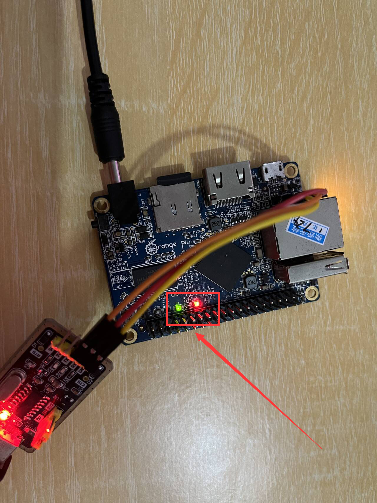

# 四：LED驱动改写为平台驱动


## 0. 平台驱动简介

平台驱动（Platform Driver）是 Linux 内核中的一种设备驱动程序模式，主要用于与特定的硬件平台（如 SOC 上的设备）交互。它通过设备树或其他固件描述来获取硬件资源，并使得驱动程序与硬件资源的绑定更加动态和灵活。

**设备树（Device Tree）或固件描述：**

- 平台驱动依赖于设备树或其他固件描述（如 ACPI）来定义硬件资源。这些描述提供了设备的内存映射地址、中断号、时钟信息等，使得驱动程序不需要硬编码这些信息，而是动态获取。
- 在设备树中，设备通过 `compatible` 属性与特定的驱动程序关联。驱动程序根据这个属性来匹配并初始化对应的设备。

**设备和驱动的绑定：**

- 当内核启动时，它会扫描设备树或固件描述文件，识别系统中的所有设备。每个设备节点会与相应的驱动程序进行匹配。
- 如果找到匹配的驱动程序，内核会调用驱动的 `probe` 函数，驱动程序则会在 `probe` 函数中初始化设备、映射资源等。

**资源管理：**

- 平台驱动通过 `platform_get_resource` 获取设备的硬件资源（如寄存器地址、IRQ）。这些资源通过 `devm_*` 系列函数进行管理，这些函数在设备驱动卸载时会自动释放资源，减少资源管理的复杂性。

**动态性：**

- 平台驱动可以在内核运行时加载或卸载，而设备树描述的硬件资源可以在运行时被绑定到合适的驱动程序上。与硬编码的驱动程序相比，平台驱动更为灵活。


## 1. 设备树修改

进入linux-4.9文件夹。要修改的驱动为：

```bash
sudo vi ./arch/arm/boot/dts/sun8i-h3-orangepi-one.dts
```

在根节点中新增一个LED结点，用来描述两个LED。

```c
/ {
	model = "Xunlong Orange Pi One";
	compatible = "xunlong,orangepi-one", "allwinner,sun8i-h3";

	aliases {
		serial0 = &uart0;
		ethernet0 = &emac;
		lcd0 = &lcd0;
	};

	chosen {
		stdout-path = "serial0:115200n8";
	};

	leds {
		compatible = "gpio-leds";
		pinctrl-names = "default";
		pinctrl-0 = <&leds_opc>, <&leds_r_opc>;

		pwr_led {
			label = "orangepi:green:pwr";
			gpios = <&r_pio 0 10 GPIO_ACTIVE_HIGH>;
			default-state = "on";
		};

		status_led {
			label = "orangepi:red:status";
			gpios = <&pio 0 15 GPIO_ACTIVE_HIGH>;
		};
	};

	// 我新增的LED结点
    myled {
        compatible = "huangcheng,myled";
        reg = <0x01c20800 0x20>,    /* 红色LED的寄存器地址 */
              <0x01f02c00 0x20>;    /* 绿色LED的寄存器地址 */
        reg-names = "red", "green";
    };
```

说明一下，为什么不能用leds，是因为这个系统镜像不知道怎么回事，GPIO都没挂上来，sys目录里面什么都没有，没法用，只能自己新写一个结点来描述。

以下是我的整个新的 sun8i-h3-orangepi-one.dts 

```c
/*
 * Copyright (C) 2016 Hans de Goede <hdegoede@redhat.com>
 *
 * This file is dual-licensed: you can use it either under the terms
 * of the GPL or the X11 license, at your option. Note that this dual
 * licensing only applies to this file, and not this project as a
 * whole.
 *
 *  a) This file is free software; you can redistribute it and/or
 *     modify it under the terms of the GNU General Public License as
 *     published by the Free Software Foundation; either version 2 of the
 *     License, or (at your option) any later version.
 *
 *     This file is distributed in the hope that it will be useful,
 *     but WITHOUT ANY WARRANTY; without even the implied warranty of
 *     MERCHANTABILITY or FITNESS FOR A PARTICULAR PURPOSE.  See the
 *     GNU General Public License for more details.
 *
 * Or, alternatively,
 *
 *  b) Permission is hereby granted, free of charge, to any person
 *     obtaining a copy of this software and associated documentation
 *     files (the "Software"), to deal in the Software without
 *     restriction, including without limitation the rights to use,
 *     copy, modify, merge, publish, distribute, sublicense, and/or
 *     sell copies of the Software, and to permit persons to whom the
 *     Software is furnished to do so, subject to the following
 *     conditions:
 *
 *     The above copyright notice and this permission notice shall be
 *     included in all copies or substantial portions of the Software.
 *
 *     THE SOFTWARE IS PROVIDED "AS IS", WITHOUT WARRANTY OF ANY KIND,
 *     EXPRESS OR IMPLIED, INCLUDING BUT NOT LIMITED TO THE WARRANTIES
 *     OF MERCHANTABILITY, FITNESS FOR A PARTICULAR PURPOSE AND
 *     NONINFRINGEMENT. IN NO EVENT SHALL THE AUTHORS OR COPYRIGHT
 *     HOLDERS BE LIABLE FOR ANY CLAIM, DAMAGES OR OTHER LIABILITY,
 *     WHETHER IN AN ACTION OF CONTRACT, TORT OR OTHERWISE, ARISING
 *     FROM, OUT OF OR IN CONNECTION WITH THE SOFTWARE OR THE USE OR
 *     OTHER DEALINGS IN THE SOFTWARE.
 */

/dts-v1/;
#include "sun8i-h3.dtsi"
#include "sunxi-common-regulators.dtsi"

#include <dt-bindings/gpio/gpio.h>
#include <dt-bindings/input/input.h>
#include <dt-bindings/pinctrl/sun4i-a10.h>
#include <dt-bindings/thermal/thermal.h>

/ {
	model = "Xunlong Orange Pi One";
	compatible = "xunlong,orangepi-one", "allwinner,sun8i-h3";

	aliases {
		serial0 = &uart0;
		ethernet0 = &emac;
		lcd0 = &lcd0;
	};

	chosen {
		stdout-path = "serial0:115200n8";
	};

	leds {
		compatible = "gpio-leds";
		pinctrl-names = "default";
		pinctrl-0 = <&leds_opc>, <&leds_r_opc>;

		pwr_led {
			label = "orangepi:green:pwr";
			gpios = <&r_pio 0 10 GPIO_ACTIVE_HIGH>;
			default-state = "on";
		};

		status_led {
			label = "orangepi:red:status";
			gpios = <&pio 0 15 GPIO_ACTIVE_HIGH>;
		};
	};

	// 我新增的LED结点
    myled {
        compatible = "huangcheng,myled";
        reg = <0x01c20800 0x20>,    /* 红色LED的寄存器地址 */
              <0x01f02c00 0x20>;    /* 绿色LED的寄存器地址 */
        reg-names = "red", "green";
    };

	r_gpio_keys {
		compatible = "gpio-keys";
		pinctrl-names = "default";
		pinctrl-0 = <&sw_r_opc>;

		sw4 {
			label = "sw4";
			linux,code = <BTN_0>;
			gpios = <&r_pio 0 3 GPIO_ACTIVE_LOW>;
		};
	};

	vdd_cpux: gpio-regulator {
		compatible = "regulator-gpio";

		pinctrl-names = "default";
		pinctrl-0 = <&vdd_cpux_r_opc>;

		regulator-name = "vdd-cpux";
		regulator-type = "voltage";
		regulator-boot-on;
		regulator-always-on;
		regulator-min-microvolt = <1100000>;
		regulator-max-microvolt = <1300000>;
		regulator-enable-ramp-delay = <200>; /* 1ms */

		gpios = <&r_pio 0 6 GPIO_ACTIVE_HIGH>;
		gpios-states = <0x1>;
		states = <1100000 0x0
			  1300000 0x1>;
	};
};

&cpu0 {
	operating-points = <
		1200000	1300000
		1008000	1300000
		816000	1100000
		624000	1100000
		480000	1100000
		312000	1100000
		240000	1100000
		120000	1100000
		>;
	#cooling-cells = <2>;
	cooling-min-level = <0>;
	cooling-max-level = <7>;
	cpu0-supply = <&vdd_cpux>;
};

&cpu_thermal {
	trips {
		cpu_warm: cpu_warm {
			temperature = <65000>;
			hysteresis = <2000>;
			type = "passive";
		};
		cpu_hot: cpu_hot {
			temperature = <75000>;
			hysteresis = <2000>;
			type = "passive";
		};
		cpu_very_hot: cpu_very_hot {
			temperature = <90000>;
			hysteresis = <2000>;
			type = "passive";
		};
		cpu_crit: cpu_crit {
			temperature = <105000>;
			hysteresis = <2000>;
			type = "critical";
		};
	};

	cooling-maps {
		cpu_warm_limit_cpu {
			trip = <&cpu_warm>;
			cooling-device = <&cpu0 THERMAL_NO_LIMIT 2>;
		};
		cpu_hot_limit_cpu {
			trip = <&cpu_hot>;
			cooling-device = <&cpu0 2 4>;
		};
		cpu_very_hot_limit_cpu {
			trip = <&cpu_very_hot>;
			cooling-device = <&cpu0 6 THERMAL_NO_LIMIT>;
		};
	};
};

&de {
	status = "okay";
};

&ehci0 {
	status = "okay";
};

&ehci1 {
	status = "okay";
};

&emac {
	phy-handle = <&int_mii_phy>;
	phy-mode = "mii";
	allwinner,leds-active-low;
	status = "okay";
};

&hdmi {
	status = "okay";
};

&i2s2 {
	status = "okay";
};

&lcd0 {
	status = "okay";
};

&mmc0 {
	pinctrl-names = "default";
	pinctrl-0 = <&mmc0_pins_a>, <&mmc0_cd_pin>;
	vmmc-supply = <&reg_vcc3v3>;
	bus-width = <4>;
	cd-gpios = <&pio 5 6 GPIO_ACTIVE_HIGH>; /* PF6 */
	cd-inverted;
	status = "okay";
};

&ohci0 {
	status = "okay";
};

&ohci1 {
	status = "okay";
};

&pio {
	leds_opc: led_pins@0 {
		allwinner,pins = "PA15";
		allwinner,function = "gpio_out";
		allwinner,drive = <SUN4I_PINCTRL_10_MA>;
		allwinner,pull = <SUN4I_PINCTRL_NO_PULL>;
	};

	usb0_id_detect_pin: usb0_id_detect_pin@0 {
		allwinner,pins = "PG12";
		allwinner,function = "gpio_in";
		allwinner,drive = <SUN4I_PINCTRL_10_MA>;
		allwinner,pull = <SUN4I_PINCTRL_NO_PULL>;
	};
};

&r_pio {
	leds_r_opc: led_pins@0 {
		allwinner,pins = "PL10";
		allwinner,function = "gpio_out";
		allwinner,drive = <SUN4I_PINCTRL_10_MA>;
		allwinner,pull = <SUN4I_PINCTRL_NO_PULL>;
	};

	sw_r_opc: key_pins@0 {
		allwinner,pins = "PL3";
		allwinner,function = "gpio_in";
		allwinner,drive = <SUN4I_PINCTRL_10_MA>;
		allwinner,pull = <SUN4I_PINCTRL_NO_PULL>;
	};

	vdd_cpux_r_opc: regulator_pins@0 {
		allwinner,pins = "PL6";
		allwinner,function = "gpio_out";
		allwinner,drive = <SUN4I_PINCTRL_10_MA>;
		allwinner,pull = <SUN4I_PINCTRL_NO_PULL>;
	};

	usb0_vbus_pin_opipc: usb0_vbus_pin@0 {
		allwinner,pins = "PL2";
		allwinner,function = "gpio_out";
		allwinner,drive = <SUN4I_PINCTRL_10_MA>;
		allwinner,pull = <SUN4I_PINCTRL_NO_PULL>;
	};
};

&reg_usb0_vbus {
	pinctrl-0 = <&usb0_vbus_pin_opipc>;
	gpio = <&r_pio 0 2 GPIO_ACTIVE_HIGH>; /* PL2 */
	status = "okay";
};

&uart0 {
	pinctrl-names = "default";
	pinctrl-0 = <&uart0_pins_a>;
	status = "okay";
};

&uart1 {
	pinctrl-names = "default";
	pinctrl-0 = <&uart1_pins>;
	status = "disabled";
};

&uart2 {
	pinctrl-names = "default";
	pinctrl-0 = <&uart2_pins>;
	status = "disabled";
};

&uart3 {
	pinctrl-names = "default";
	pinctrl-0 = <&uart3_pins>;
	status = "disabled";
};

&usb_otg {
	dr_mode = "otg";
	status = "okay";
};

&usbphy {
	/* USB VBUS is always on except for the OTG port */
	status = "okay";
	pinctrl-names = "default";
	pinctrl-0 = <&usb0_id_detect_pin>;
	usb0_id_det-gpios = <&pio 6 12 GPIO_ACTIVE_HIGH>; /* PG12 */
	usb0_vbus-supply = <&reg_usb0_vbus>;
};

```

然后只能通过重新编译Linux内核来编译设备树，我用dtc工具，不知道为什么指定include目录总是不行，我用 -i 选项试了好多次，总是提示我第一个include不行，人都麻了，重新编译Linux内核附带编译设备树倒是可以了。

得到的 sun8i-h3-orangepi-one.dtb 还是放入TF卡第一个分区中，让u-boot自动加载就行了。


## 2. 平台驱动开发

myled.h

```c
//
// Created by huangcheng on 2024/9/3.
//

#ifndef HC_LINUX_DRIVER_MYLED_H
#define HC_LINUX_DRIVER_MYLED_H

// 平台驱动的开发框架

#include <linux/init.h>
#include <linux/module.h>
#include <linux/kernel.h>
#include <linux/fs.h>
#include <linux/uaccess.h>
#include <linux/slab.h>
#include <linux/mutex.h>
#include <linux/device.h>
#include <linux/cdev.h>
#include <linux/io.h>
#include <linux/of.h>
#include <linux/of_device.h>
#include <linux/platform_device.h>

// 如果有多个相同的设备，就可以复用这一数据结构
// 而且，把所需的资源封装在结构体里面，而不是搞成多个全局变量，会更加安全
struct led_dev {
    struct cdev cdev;
    void __iomem *led_base_addr;    // led的地址
    int led_status;                 // led的状态，0是灭，1是亮
    struct mutex dev_mutex;         // 互斥锁，保证同时只有一个执行流可以操作设备
};

// 设备名
#define DEVICE_NAME "myled"
// 设备类名（在/dev/文件夹中创建设备文件需要，这是为了归类设备的文件夹）
#define CLASS_NAME "leddev"

// 平台驱动初始化函数
static int led_probe(struct platform_device *pdev);
// 平台驱动退出函数
static int led_remove(struct platform_device *pdev);

// 作为字符设备的情况下需要实现的函数
static int dev_open(struct inode *inodep, struct file *filep);
static int dev_release(struct inode *inodep, struct file *filep);
static ssize_t dev_read(struct file *filep, char *user_buffer, size_t len, loff_t *offset);
static ssize_t dev_write(struct file *filep, const char *user_buffer, size_t len, loff_t *offset);

// 设备驱动相关信息，这里写了就可以查询文件信息得到
MODULE_LICENSE("GPL");
MODULE_AUTHOR("huangcheng");
MODULE_DESCRIPTION("A platform led driver for OrangePi One");
MODULE_VERSION("1.0");

#endif //HC_LINUX_DRIVER_MYLED_H

```

myled.c

```c
//
// Created by huangcheng on 2024/9/3.
//

#include "myled.h"

// 匹配设备树中的`compatible`字段，通过这个，找到对应的结点
static struct of_device_id myled_of_match[] = {
        { .compatible = "huangcheng,myled", },
        { },
};
MODULE_DEVICE_TABLE(of, myled_of_match);

// 平台驱动结构体，通过of_match_table来匹配到对应的结点，进而载入平台设备
static struct platform_driver myled_driver = {
        .probe = led_probe,
        .remove = led_remove,
        .driver = {
                .name = DEVICE_NAME,
                .of_match_table = myled_of_match,
                .owner = THIS_MODULE,
        },
};

module_platform_driver(myled_driver);

// 文件操作符，通过这个，就可以像操作文件一样操作设备（把设备抽象成文件就是这么抽象的）
static struct file_operations fops = {
        .open = dev_open,
        .release = dev_release,
        .read = dev_read,
        .write = dev_write,
};

// 设备号，向内核注册驱动的时候获得的一个唯一ID，通过设备号可以找到这个设备
static int majorNumber;
// 设备类（用来将设备归类，在对应的/dev/ClassName文件夹下可以看到相应的设备）
static struct class* devClass = NULL;

// 全局设备数据结构指针（每个设备自己单独的资源）
static struct led_dev *red_led_device_data;
static struct led_dev *green_led_device_data;

// 寄存器偏移量
#define GPIO_CFG_OFFSET 0x00        // 配置寄存器
#define GPIO_DATA_OFFSET 0x10       // 数据寄存器

static int led_probe(struct platform_device *pdev) {
    // pdev 是 myled_driver结构体给出的参数，匹配后就取到了

    struct resource *res;
    dev_t dev_no;
    int err;
    unsigned int cfg_value;

    // 分配内存给红色LED设备数据结构，用devm_kzalloc的话，意外退出会自动被内核回收所有资源，就不用自行回收了
    red_led_device_data = devm_kzalloc(&pdev->dev, sizeof(struct led_dev), GFP_KERNEL);
    if (!red_led_device_data) {
        dev_err(&pdev->dev, "Failed to allocate memory for red_led_device_data\n");
        return -ENOMEM;
    }

    // 分配内存给绿色LED设备数据结构
    green_led_device_data = devm_kzalloc(&pdev->dev, sizeof(struct led_dev), GFP_KERNEL);
    if (!green_led_device_data) {
        dev_err(&pdev->dev, "Failed to allocate memory for green_led_device_data\n");
        return -ENOMEM;
    }

    // 从设备树中获取红色LED的资源，通过资源的名字就能获取，红色，对应的资源就是<0x01c20800, 0x20>
    res = platform_get_resource_byname(pdev, IORESOURCE_MEM, "red");
    if (!res) {
        dev_err(&pdev->dev, "Failed to get red LED resource\n");
        return -ENODEV;
    }
    // 理论上来说应该这么写才对，但是devm_ioremap_resource会申请映射，会碰上Linux中的驱动已经映射的问题，所以只能用ioremap强行占据
    // red_led_device_data->led_base_addr = devm_ioremap_resource(&pdev->dev, res);
    red_led_device_data->led_base_addr = ioremap(res->start, resource_size(res));

    // 如果没获取到资源就直接退出返回顺便报个错
    if (IS_ERR(red_led_device_data->led_base_addr)) {
        dev_err(&pdev->dev, "Failed to map red LED registers\n");
        return PTR_ERR(red_led_device_data->led_base_addr);
    }

    // 从设备树中获取绿色LED的资源
    res = platform_get_resource_byname(pdev, IORESOURCE_MEM, "green");
    if (!res) {
        dev_err(&pdev->dev, "Failed to get green LED resource\n");
        return -ENODEV;
    }
    // 同red_led_device_data
    // green_led_device_data->led_base_addr = devm_ioremap_resource(&pdev->dev, res);
    green_led_device_data->led_base_addr = ioremap(res->start, resource_size(res));

    if (IS_ERR(green_led_device_data->led_base_addr)) {
        dev_err(&pdev->dev, "Failed to map green LED registers\n");
        return PTR_ERR(green_led_device_data->led_base_addr);
    }

    // 注册字符设备主设备，把文件操作符传过去，这样就能通过文件操作符像操作普通文件一样操作设备了
    majorNumber = register_chrdev(0, DEVICE_NAME, &fops);
    if (majorNumber < 0) {
        dev_err(&pdev->dev, "Failed to register a major number\n");
        return majorNumber;
    }

    // 创建设备类
    devClass = class_create(THIS_MODULE, CLASS_NAME);
    if (IS_ERR(devClass)) {
        unregister_chrdev(majorNumber, DEVICE_NAME);
        dev_err(&pdev->dev, "Failed to create device class\n");
        return PTR_ERR(devClass);
    }

    // 创建设备文件节点（红色LED），这里就分主从设备了，红色LED是从设备0
    dev_no = MKDEV(majorNumber, 0);
    cdev_init(&red_led_device_data->cdev, &fops);
    red_led_device_data->cdev.owner = THIS_MODULE;
    err = cdev_add(&red_led_device_data->cdev, dev_no, 1);
    if (err) {
        class_destroy(devClass);
        unregister_chrdev(majorNumber, DEVICE_NAME);
        dev_err(&pdev->dev, "Failed to add red LED cdev\n");
        return err;
    }
    device_create(devClass, NULL, dev_no, NULL, "myled_red");

    // 创建设备文件节点（绿色LED），绿色LED是从设备1
    dev_no = MKDEV(majorNumber, 1);
    cdev_init(&green_led_device_data->cdev, &fops);
    green_led_device_data->cdev.owner = THIS_MODULE;
    err = cdev_add(&green_led_device_data->cdev, dev_no, 1);
    if (err) {
        device_destroy(devClass, MKDEV(majorNumber, 0));
        cdev_del(&red_led_device_data->cdev);
        class_destroy(devClass);
        unregister_chrdev(majorNumber, DEVICE_NAME);
        dev_err(&pdev->dev, "Failed to add green LED cdev\n");
        return err;
    }
    device_create(devClass, NULL, dev_no, NULL, "myled_green");

    // 最后初始化所有资源

    // 初始化互斥锁
    mutex_init(&red_led_device_data->dev_mutex);
    mutex_init(&green_led_device_data->dev_mutex);

    // 把红色LED对应的GPIO设置为输出模式
    cfg_value = ioread32(red_led_device_data->led_base_addr + GPIO_CFG_OFFSET);                 // 设置红色LED对应的GPIO引脚
    cfg_value &= ~(0xf << 28);                                                                  // 更新写入值
    iowrite32(cfg_value, red_led_device_data->led_base_addr + GPIO_CFG_OFFSET);                 // 清除第15引脚配置
    cfg_value |= (1 << 28);                                                                     // 更新写入值
    iowrite32(cfg_value, red_led_device_data->led_base_addr + GPIO_CFG_OFFSET);                 // 设置这个引脚为输出模式

    // 把绿色LED对应的GPIO设置为输出模式
    cfg_value = ioread32(green_led_device_data->led_base_addr + GPIO_CFG_OFFSET);               // 设置绿色LED对应的GPIO引脚
    cfg_value &= ~(0xf << 20);                                                                  // 更新写入值
    iowrite32(cfg_value, green_led_device_data->led_base_addr + GPIO_CFG_OFFSET);               // 清除第10个引脚配置
    cfg_value |= (1 << 20);                                                                     // 更新写入值
    iowrite32(cfg_value, green_led_device_data->led_base_addr + GPIO_CFG_OFFSET);               // 设置这个引脚为输出模式

    printk(KERN_INFO "LED platform driver initialized successfully\n");
    return 0;
}

static int led_remove(struct platform_device *pdev) {
    // 删除红色LED的设备节点和字符设备
    device_destroy(devClass, MKDEV(majorNumber, 0));
    cdev_del(&red_led_device_data->cdev);

    // 删除绿色LED的设备节点和字符设备
    device_destroy(devClass, MKDEV(majorNumber, 1));
    cdev_del(&green_led_device_data->cdev);

    // 销毁设备类
    class_destroy(devClass);

    // 注销字符设备
    unregister_chrdev(majorNumber, DEVICE_NAME);

    // 销毁互斥锁
    mutex_destroy(&red_led_device_data->dev_mutex);
    mutex_destroy(&green_led_device_data->dev_mutex);

    // 因为资源的内存是用devm_kzalloc申请的
    // 在退出的时候，内存会被内核自动回收，所以不用自己回收了

    printk(KERN_INFO "LED platform driver removed successfully\n");
    return 0;
}

static int dev_open(struct inode *inodep, struct file *filep) {
    struct led_dev *dev;

    dev = container_of(inodep->i_cdev, struct led_dev, cdev);
    filep->private_data = dev;

    printk(KERN_INFO "myled: Device has been opened\n");
    return 0;
}

static int dev_release(struct inode *inodep, struct file *filep) {
    printk(KERN_INFO "myled: Device successfully closed\n");
    return 0;
}

static ssize_t dev_read(struct file *filep, char *user_buffer, size_t len, loff_t *offset) {
    struct led_dev *dev = filep->private_data;  // 获取当前设备的数据结构
    char status[16];  // 保存状态信息的字符串
    int error_count = 0;
    int status_len;

    // 只允许在文件偏移量为0时读取数据，防止重复读取
    if (*offset > 0) {
        return 0;  // EOF
    }

    if (mutex_lock_interruptible(&dev->dev_mutex)) {
        return -ERESTARTSYS;
    }

    // 读取LED的当前状态
    if (dev == red_led_device_data) {
        dev->led_status = (ioread32(dev->led_base_addr + GPIO_DATA_OFFSET) & (1 << 15)) ? 1 : 0;
    } else if (dev == green_led_device_data) {
        dev->led_status = (ioread32(dev->led_base_addr + GPIO_DATA_OFFSET) & (1 << 10)) ? 1 : 0;
    }

    // 将状态转换为字符串，表示 LED 是 ON 还是 OFF
    snprintf(status, sizeof(status), "LED is %s\n", dev->led_status ? "ON" : "OFF");
    status_len = strlen(status);

    // 将状态字符串复制到用户空间
    error_count = copy_to_user(user_buffer, status, status_len);

    mutex_unlock(&dev->dev_mutex);

    if (error_count == 0) {
        *offset = status_len;
        return status_len;
    } else {
        printk(KERN_INFO "myled: Failed to send %d characters to the user\n", error_count);
        return -EFAULT;
    }
}

static ssize_t dev_write(struct file *filep, const char *user_buffer, size_t len, loff_t *offset) {
    struct led_dev *dev = filep->private_data;  // 获取当前设备的数据结构
    char input;

    if (len > 0) {
        // 从用户空间复制一个字符数据到内核空间
        if (copy_from_user(&input, user_buffer, 1) != 0) {
            return -EFAULT;
        }

        if (mutex_lock_interruptible(&dev->dev_mutex)) {
            return -ERESTARTSYS;
        }

        // 根据输入决定是否切换LED状态
        switch (input) {
            case '1':
                // 打开LED
                if (dev == red_led_device_data) {
                    iowrite32(ioread32(dev->led_base_addr + GPIO_DATA_OFFSET) | (1 << 15), dev->led_base_addr + GPIO_DATA_OFFSET);
                    dev->led_status = 1;
                    printk(KERN_INFO "myled: Red LED turned ON\n");
                } else if (dev == green_led_device_data) {
                    iowrite32(ioread32(dev->led_base_addr + GPIO_DATA_OFFSET) | (1 << 10), dev->led_base_addr + GPIO_DATA_OFFSET);
                    dev->led_status = 1;
                    printk(KERN_INFO "myled: Green LED turned ON\n");
                }
                break;

            case '0':
                // 关闭LED
                if (dev == red_led_device_data) {
                    iowrite32(ioread32(dev->led_base_addr + GPIO_DATA_OFFSET) & ~(1 << 15), dev->led_base_addr + GPIO_DATA_OFFSET);
                    dev->led_status = 0;
                    printk(KERN_INFO "myled: Red LED turned OFF\n");
                } else if (dev == green_led_device_data) {
                    iowrite32(ioread32(dev->led_base_addr + GPIO_DATA_OFFSET) & ~(1 << 10), dev->led_base_addr + GPIO_DATA_OFFSET);
                    dev->led_status = 0;
                    printk(KERN_INFO "myled: Green LED turned OFF\n");
                }
                break;

            default:
                printk(KERN_INFO "myled: Invalid input\n");
                break;
        }

        mutex_unlock(&dev->dev_mutex);
    }
    return len;
}

```

Makefile还是这个。

```makefile
# 指定内核构建目录
KERNELDIR := /home/hc/orangepi_h3_linux/OrangePi-Kernel/linux-4.9

# 当前目录
PWD := $(shell pwd)

# 交叉编译器前缀
CROSS_COMPILE := arm-linux-gnueabi-

# 架构
ARCH := arm

# 内核模块目标
obj-m := myled.o

# 默认目标
all:
	$(MAKE) -C $(KERNELDIR) M=$(PWD) ARCH=$(ARCH) CROSS_COMPILE=$(CROSS_COMPILE) modules

# 清理目标
clean:
	$(MAKE) -C $(KERNELDIR) M=$(PWD) ARCH=$(ARCH) CROSS_COMPILE=$(CROSS_COMPILE) clean

.PHONY: all clean

```


## 3. 上机演示

编译，放到TF卡第二分区的home目录里面，上Orange Pi One运行。

```bash
/home # insmod myled.ko
[   55.212396] myled: loading out-of-tree module taints kernel.
[   55.219212] LED platform driver initialized successfully
/home # cat /dev/myled_red
[   79.723225] myled: Device has been opened
LED is OFF[   79.727338] myled: Device successfully closed

/home # cat /dev/myled_green
[   93.045011] myled: Device has been opened
LED is ON[   93.049111] myled: Device successfully closed

/home # echo 1 > /dev/myled_red
[  112.523717] myled: Device has been opened
[  112.527847] myled: Red LED turned ON
[  112.531496] myled: Device successfully closed
/home # echo 0 > /dev/myled_red
[  147.633974] myled: Device has been opened
[  147.638088] myled: Red LED turned OFF
[  147.641822] myled: Device successfully closed
/home # echo 0 > /dev/myled_green
[  159.802983] myled: Device has been opened
[  159.807112] myled: Green LED turned OFF
[  159.811004] myled: Device successfully closed

```

效果如图所示：

进入Linux系统之后，只有绿色的电源LED亮着。

`echo 1 > /dev/myled_red` 将红色状态LED打开。



`echo 0 > /dev/myled_red`  和  `echo 0 > /dev/myled_green` 之后，把两个LED都关掉。


可以看到，驱动的使用完全正常，符合最初的设想。