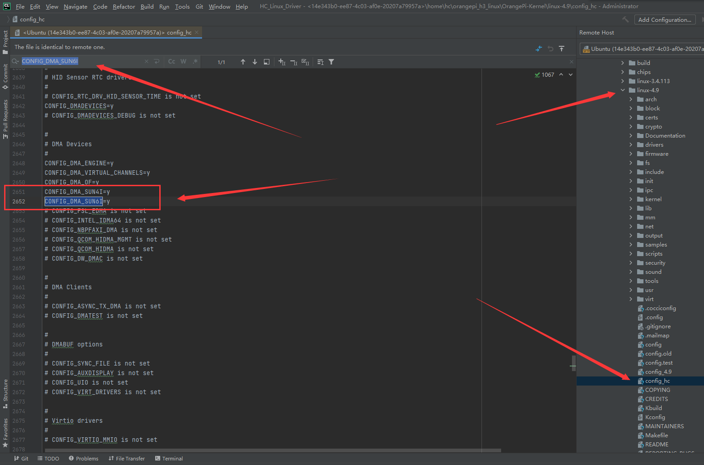

# 六：加载DMA驱动到内核中


## 1. 去除内核中的DMA驱动

这也是没办法的事，又要重新编内核了，因为之前的DMA驱动是编译进内核的，没法通过卸载内核模块的方式卸载掉。既然卸载不掉，那么DMA驱动占据的资源比如映射、IRQ中断，我们就没法用了，因为DMA使用的中断号是已经确定了的。

所以没办法，只能重新编译内核，记得保存原有的内核镜像，我复制了一份副本，原来的镜像命名为 `old_zImage` 。

还是老规矩，进入linux-4.9目录之后：

```bash
sudo make mrproper
sudo make sun8iw7p1_mainline_defconfig

```

然后复制一份配置文件，更改配置文件权限，不然没法编辑。

```bash
sudo cp .config config_hc
sudo chmod 777 config_hc

```

用IDE（我的是CLion）编辑.config文件，查找的内容是

```
CONFIG_DMA_SUN6I
```

具体位置是



这个驱动都给注释掉，其他的DMA相关支持选项不要动，否则编译出来驱动也没法用。

```
#CONFIG_DMA_SUN6I=y
```

学其他配置项的做法，改成

```
# CONFIG_DMA_SUN6I is not set
```

也可以。

说明一下，留着 `CONFIG_DMA_SUN4I` 是因为如果DMA驱动都被去掉了，编译前检查会直接把DMA虚拟通道支持去掉，我试了很多办法都不行，而留着这个，这板子也用不了，所以还可以接受，只是为了防止编译前检查把DMA虚拟通道支持去掉。

然后保存，上传，指定配置文件编译。

```bash
sudo make ARCH=arm CROSS_COMPILE=arm-linux-gnueabi- KCONFIG_CONFIG=config_hc

```

编译出新的zImage之后，给它放到TF卡第一分区中，进入系统，进入 `/sys/class` 目录下查看还有没有DMA驱动。

```bash
/ # ls /sys/class
bdi            extcon         mem            rfkill         vc
block          gpio           misc           rtc            vtconsole
bsg            graphics       mmc_host       scsi_device    watchdog
devfreq        hwmon          net            scsi_disk
devfreq-event  i2c-adapter    phy            scsi_host
dma            input          power_supply   thermal
drm            leds           regulator      tty
/ # ls /sys/class/dma
/ # 

```

成功去掉了原来内核自带的DMA驱动。


## 2. 让Linux内核加载并初始化这个DMA驱动

其实就是 `hc_dma_probe` 和 `hc_dma_remove` 的实现，这两个比较麻烦，但是几乎又是标准化的。

```c
// 新增头文件
#include <linux/io.h>

// 新增函数声明

static void hc_free_dma_task_descriptor(struct virt_dma_desc *vd);
static struct dma_chan *hc_dma_of_xlate(struct of_phandle_args *dma_spec, struct of_dma *ofdma);

/*
 * DMA探测函数
 * 功能: 当平台设备被探测到时，初始化DMA控制器。
 */
static int hc_dma_probe(struct platform_device *pdev) {
    struct resource *res;               // 资源
    DMA_DEV_Info *dma_dev;              // DMA设备信息结构体
    const struct of_device_id *match;   // 匹配表信息
    int ret, i;                         // 返回结果和计数器

    // 给DMA设备信息结构体分配内存
    dma_dev = devm_kzalloc(&pdev->dev, sizeof(*dma_dev), GFP_KERNEL);
    if (!dma_dev) {
        // 分配失败返回
        return -ENOMEM;
    }

    // 获取匹配表里面的配置数据（也就是物理通道数、虚拟通道数、最大请求ID）
    match = of_match_device(hc_dma_of_match, &pdev->dev);
    if (!match) {
        return -EINVAL;
    }
    dma_dev->cfg = match->data;

    // 从设备树获取资源
    res = platform_get_resource(pdev, IORESOURCE_MEM, 0);
    // 直接从资源里面读出物理地址和映射大小，然后建立映射关系
    dma_dev->base_addr = devm_ioremap_resource(&pdev->dev, res);
    if (IS_ERR(dma_dev->base_addr)) {
        return PTR_ERR(dma_dev->base_addr);
    }

    // 从设备树获取IRQ中断号
    dma_dev->irq = platform_get_irq(pdev, 0);
    if (dma_dev->irq < 0) {
        dev_err(&pdev->dev, "Failed to get IRQ\n");
        return dma_dev->irq;
    }
    // 向内核申请对应的IRQ中断，参数是设备、中断号、中断处理函数、设备名、设备数据
    ret = devm_request_irq(&pdev->dev, dma_dev->irq, hc_dma_interrupt, 0, pdev->name, dma_dev);
    if (ret) {
        dev_err(&pdev->dev, "Failed to request IRQ\n");
        return ret;
    }

    // 从设备中获取DMA控制器需要的时钟控制资源
    dma_dev->clk = devm_clk_get(&pdev->dev, NULL);
    if (IS_ERR(dma_dev->clk)) {
        dev_err(&pdev->dev, "Failed to get clock\n");
        return PTR_ERR(dma_dev->clk);
    }

    // 从设备中获取DMA控制器需要的复位控制资源
    dma_dev->rstc = devm_reset_control_get(&pdev->dev, NULL);
    if (IS_ERR(dma_dev->rstc)) {
        dev_err(&pdev->dev, "Failed to get reset controller\n");
        return PTR_ERR(dma_dev->rstc);
    }

    // 创建管理DMA描述符的内存池，用于管理硬件DMA控制器所需的描述符结构体DMA_HardWare_Descriptor
    // 参数为：设备名，设备结构体，描述符大小，对齐要求（这里要求4字节），内存分配粒度（0是默认）
    dma_dev->pool = dmam_pool_create(dev_name(&pdev->dev), &pdev->dev, sizeof(DMA_HardWare_Descriptor), 4, 0);
    if (!dma_dev->pool) {
        dev_err(&pdev->dev, "Failed to create DMA descriptor pool\n");
        return -ENOMEM;
    }

    // 初始化自旋锁
    spin_lock_init(&dma_dev->lock);
    // 初始化当前DMA设备挂起排队的任务的双向链表头结点
    INIT_LIST_HEAD(&dma_dev->pending);
    // 初始化当前DMA设备具有的通道链表头结点
    INIT_LIST_HEAD(&dma_dev->slave.channels);

    // 设置该DMA设备的功能，指定支持的功能

    // DMA_PRIVATE: 表示该设备只能被某些特定的设备使用，通常指的是专有的、私有的DMA通道，
    // 这里的私有指的是不会和其他外设共享通道，这种类型的DMA不被其他设备抢占或复用，用于保证特定设备的DMA任务。
    dma_cap_set(DMA_PRIVATE, dma_dev->slave.cap_mask);

    // DMA_MEMCPY: 该DMA设备支持内存到内存的传输（Memory Copy）。这是最常见的DMA操作之一，
    // 用于在不同内存区域之间快速移动数据。
    dma_cap_set(DMA_MEMCPY, dma_dev->slave.cap_mask);

    // DMA_SLAVE: 该设备支持从设备到内存，或者内存到设备的传输。这通常用于外设传输数据的场景，
    // 例如从UART、I2C等外设进行数据传输时，通过DMA加速数据读写。
    // DMA_SLAVE 是指 DMA 控制器将外设视为“主设备”，它在主设备与内存之间传输数据。
    dma_cap_set(DMA_SLAVE, dma_dev->slave.cap_mask);

    // DMA_CYCLIC: 支持循环传输模式，这种模式常用于音频、视频等实时数据流的传输，数据可以在缓冲区中
    // 循环传输，而无需在每次传输完成后重新设置地址或重新配置DMA。
    dma_cap_set(DMA_CYCLIC, dma_dev->slave.cap_mask);


    // 指定该DMA设备的各个功能的函数指针（slave这个结构体成员的类型来自于Linux源代码目录下的include/linux/dmaengine.h，第712行开始）
    dma_dev->slave.device_alloc_chan_resources = hc_dma_alloc_chan_resources;     // 分配DMA通道资源
    dma_dev->slave.device_free_chan_resources  = hc_dma_free_chan_resources;      // 释放DMA通道资源
    dma_dev->slave.device_prep_dma_memcpy      = hc_dma_prep_dma_memcpy;          // 准备一个内存拷贝操作

    // 缺失device_prep_dma_xor，该函数用于内存数据块的异或操作（常用于 RAID 校验）。
    // 主要用于 RAID 系统中，通过异或多个数据块生成校验数据块。

    // 缺失device_prep_dma_xor_val，该函数用于检查多个数据块之间的 XOR 和验证。
    // 用于验证多个数据块之间的异或校验结果，确保数据完整性，通常在 RAID 校验中使用。

    // 缺失device_prep_dma_pq，该函数用于准备 PQ 操作，常用于高级 RAID 校验（例如 RAID-6）。
    // PQ 操作涉及两个校验数据块，通常用于 RAID-6 级别的数据校验。

    // 缺失device_prep_dma_pq_val，该函数用于验证 PQ 校验和。
    // 用于 RAID-6 校验，验证生成的 PQ 校验数据是否正确。

    // 缺失device_prep_dma_memset，该函数用于准备 DMA 内存清零操作（如 memset）。
    // 通过 DMA 进行内存的填充操作，例如将内存块初始化为一个特定的值（如清零）。

    // 缺失device_prep_dma_memset_sg，该函数用于准备 scatter-gather 形式的内存填充操作。
    // 类似于 memset，但操作的是一个 scatter-gather 列表，用于分散的内存块进行填充。

    // 缺失device_prep_dma_interrupt，该函数用于准备传输完成时触发的中断。
    // 当 DMA 操作完成后，通过中断通知处理器，通常用于实时通知系统传输完成。

    // 缺失device_prep_dma_sg，该函数用于准备散列-聚集（scatter-gather）的传输操作。
    // 用于对分散的内存块进行传输，可以将多个不连续的内存块聚合到一起，或将数据分散到不同块中。

    dma_dev->slave.device_prep_slave_sg        = hc_dma_prep_slave_sg;            // 准备一个从设备的scatter-gather传输
    dma_dev->slave.device_prep_dma_cyclic      = hc_dma_prep_dma_cyclic;          // 准备一个循环DMA操作

    // 缺失device_prep_interleaved_dma，该函数用于准备交错传输，适合复杂数据结构。
    // 用于处理交错数据传输的场景，例如不同步的数据传输，或多个源/目的地址的复杂传输模式。

    // 缺失device_prep_dma_imm_data，该函数用于准备 DMA 的立即数据传输。
    // 将 8 字节的立即数据传输到目的地址，通常用于传输较小的数据块而不需要大型内存缓冲区。

    dma_dev->slave.device_config               = hc_dma_config;                   // 配置DMA通道
    dma_dev->slave.device_pause                = hc_dma_pause;                    // 暂停DMA传输
    dma_dev->slave.device_resume               = hc_dma_resume;                   // 恢复暂停的DMA传输
    dma_dev->slave.device_terminate_all        = hc_dma_terminate_all;            // 终止所有正在进行的DMA传输

    // 缺失device_synchronize，该函数用于同步DMA的终止操作。
    // 确保 DMA 通道在终止操作时所有传输任务安全结束，避免数据丢失或资源争用。

    dma_dev->slave.device_tx_status            = hc_dma_tx_status;                // 获取DMA传输状态
    dma_dev->slave.device_issue_pending        = hc_dma_issue_pending;            // 推送挂起的DMA传输任务

    // 指定DMA各项属性

    // 设置内存拷贝操作的对齐方式。这里指定了内存拷贝的对齐为 4 字节（即每次拷贝的数据块长度是4字节的倍数）。
    // 这通常与硬件要求或总线宽度相关，确保传输时对齐到4字节边界。
    dma_dev->slave.copy_align                  = DMAENGINE_ALIGN_4_BYTES;

    // 指定DMA设备支持的源地址宽度。这里设置支持的宽度有：
    // 1字节（8位）、2字节（16位）、4字节（32位）。
    // 这些宽度决定了DMA控制器一次能处理的源数据单元大小，常用于配置与外设或内存的接口宽度。
    dma_dev->slave.src_addr_widths             = BIT(DMA_SLAVE_BUSWIDTH_1_BYTE) |
                                                 BIT(DMA_SLAVE_BUSWIDTH_2_BYTES) |
                                                 BIT(DMA_SLAVE_BUSWIDTH_4_BYTES);

    // 指定DMA设备支持的目标地址宽度。这里也设置了1字节、2字节和4字节的宽度支持。
    // 这与源地址宽度类似，决定了写入到目标地址时的单元大小，可以是与内存或设备通信时的宽度。
    dma_dev->slave.dst_addr_widths             = BIT(DMA_SLAVE_BUSWIDTH_1_BYTE) |
                                                 BIT(DMA_SLAVE_BUSWIDTH_2_BYTES) |
                                                 BIT(DMA_SLAVE_BUSWIDTH_4_BYTES);

    // 指定DMA支持的传输方向，通常有：
    // 1. DMA_DEV_TO_MEM: 设备到内存传输。常见于从外设（如UART、I2C）读取数据并写入到内存中。
    // 2. DMA_MEM_TO_DEV: 内存到设备传输。常见于从内存将数据写入外设。
    // 这里配置DMA设备支持这两种传输方向（外设到内存和内存到外设）。
    dma_dev->slave.directions                  = BIT(DMA_DEV_TO_MEM) |
                                                 BIT(DMA_MEM_TO_DEV);

    // 设置DMA传输的剩余字节粒度。在 DMA 传输的过程中，驱动程序可能会查询剩余的未传输字节数。
    // 这里设置粒度为DMA_RESIDUE_GRANULARITY_BURST，表示传输剩余数据的精确度是基于DMA传输的突发传输（burst），
    // 而不是单个字节或其他更小的单位。这在高效传输大块数据时很常见。
    dma_dev->slave.residue_granularity          = DMA_RESIDUE_GRANULARITY_BURST;

    // 关联 DMA 设备与平台设备（`pdev`）的设备结构体。这是 DMA 引擎框架中的标准做法，用于
    // 表示这个 DMA 控制器与具体的硬件设备（通过平台设备）相关联。通过 `pdev->dev`，DMA 控制器可以获取
    // 设备相关的信息，例如设备的资源、名称、驱动程序等。
    dma_dev->slave.dev                          = &pdev->dev;

    // 给物理通道数组分配内存
    dma_dev->pchans = devm_kcalloc(&pdev->dev, dma_dev->cfg->max_physical_channels, sizeof(DMA_Physical_Channel_Info), GFP_KERNEL);
    if (!dma_dev->pchans) {
        return -ENOMEM;
    }
    // 给虚拟通道数组分配内存
    dma_dev->vchans = devm_kcalloc(&pdev->dev, dma_dev->cfg->max_virtual_channels, sizeof(DMA_Virtual_Channel_Info), GFP_KERNEL);
    if (!dma_dev->vchans) {
        return -ENOMEM;
    }

    // 初始化物理通道数组
    for (i = 0; i < dma_dev->cfg->max_physical_channels; i++) {
        DMA_Physical_Channel_Info *pchan = &dma_dev->pchans[i];
        pchan->index = i;
        pchan->base_addr = dma_dev->base_addr + DMA_EN_REG_OFFSET(i);

        // 现在是初始化阶段，肯定没任务，置为NULL就对了
        pchan->todo = NULL;
        pchan->done = NULL;
        pchan->vchan = NULL;
    }

    // 初始化虚拟通道数组
    for (i = 0; i < dma_dev->cfg->max_virtual_channels; i++) {
        DMA_Virtual_Channel_Info *vchan = &dma_dev->vchans[i];

        // 同理，现在是初始化阶段，没有任何任务，做一点简单的初始化就行了
        vchan->pchan = NULL;

        vchan->port = 0;
        vchan->irq_type = 0;
        vchan->cyclic = false;
        INIT_LIST_HEAD(&vchan->task_queue_head);
        vchan->task = NULL;

        // 关联描述符的free函数指针，这样内核就可以自动释放DMA描述符了，这里关联任务描述符释放函数，因为任务描述符才是DMA驱动使用，而不是硬件使用的
        vchan->vc.desc_free = hc_free_dma_task_descriptor;

        // 初始化这个虚拟通道
        vchan_init(&vchan->vc, &dma_dev->slave);
    }

    // 初始化任务调度器，用于DMA任务调度，参数为任务结构体指针、调度函数、传给调度函数的参数
    tasklet_init(&dma_dev->task, hc_dma_tasklet, (unsigned long)dma_dev);

    // 解除DMA的复位状态
    ret = reset_control_deassert(dma_dev->rstc);
    if (ret) {
        dev_err(&pdev->dev, "Couldn't deassert the device from reset\n");
        goto cleanup_dma_tasklet;
    }

    // 准备和启用之前申请的给DMA控制器的时钟
    ret = clk_prepare_enable(dma_dev->clk);
    if (ret) {
        dev_err(&pdev->dev, "Couldn't enable the clock\n");
        goto cleanup_dma_reset;
    }

    // 将DMA控制器注册到DMA引擎框架中
    ret = dma_async_device_register(&dma_dev->slave);
    if (ret) {
        dev_warn(&pdev->dev, "Failed to register DMA engine device\n");
        goto cleanup_dma_clock;
    }

    // 向设备树注册 DMA 控制器，允许其他设备通过设备树中的 dma 属性与该控制器通信
    ret = of_dma_controller_register(pdev->dev.of_node, hc_dma_of_xlate, dma_dev);
    if (ret) {
        dev_err(&pdev->dev, "of_dma_controller_register failed\n");
        goto cleanup_dma_engine_registration;
    }

    // 保存设备数据，以便其他代码通过pdev获取dma_dev。
    platform_set_drvdata(pdev, dma_dev);

    return 0;

    // 和上面的逻辑关系类似于栈，这样就能保证所有的操作都能成功回滚
cleanup_dma_engine_registration:
    dma_async_device_unregister(&dma_dev->slave);   // dma_async_device_register的反操作
cleanup_dma_clock:
    clk_disable_unprepare(dma_dev->clk);            // clk_prepare_enable的反操作
cleanup_dma_reset:
    reset_control_assert(dma_dev->rstc);            // reset_control_deassert的反操作
cleanup_dma_tasklet:
    // 这里就是清理之前的所有资源了
    // 内核不能自动回收的，就要在这里清理

    // 首先要禁用该DMA控制器的两组中断使能寄存器，防止它再打中断
    iowrite32(0, dma_dev->base_addr + DMA_IRQ_EN_REG0_OFFSET);
    iowrite32(0, dma_dev->base_addr + DMA_IRQ_EN_REG1_OFFSET);

    // 变更tasklet的运行状态为关闭
    atomic_inc(&dma_dev->tasklet_shutdown);

    // 清理虚拟通道的资源
    for (i = 0; i < dma_dev->cfg->max_virtual_channels; i++) {
        DMA_Virtual_Channel_Info *vchan = &dma_dev->vchans[i];

        // 删掉虚拟通道的设备链表结点
        list_del(&vchan->vc.chan.device_node);

        // 杀掉这个虚拟通道的tasklet，完成销毁
        tasklet_kill(&vchan->vc.task);
    }

    // 杀死该控制器的tasklet，完成所有的tasklet的销毁
    tasklet_kill(&dma_dev->task);

    // 释放申请的IRQ中断，是devm_request_irq的反操作
    devm_free_irq(dma_dev->slave.dev, dma_dev->irq, dma_dev);

    return ret;
}

/*
 * DMA移除函数
 * 功能: 当平台设备被移除时，释放资源并进行清理。
 */
static int hc_dma_remove(struct platform_device *pdev) {
    DMA_DEV_Info *dma_dev = platform_get_drvdata(pdev);
    int i;

    // 首先要禁用该DMA控制器的两组中断使能寄存器，防止它再打中断
    iowrite32(0, dma_dev->base_addr + DMA_IRQ_EN_REG0_OFFSET);
    iowrite32(0, dma_dev->base_addr + DMA_IRQ_EN_REG1_OFFSET);

    // 变更tasklet的运行状态为关闭
    atomic_inc(&dma_dev->tasklet_shutdown);

    // 清理虚拟通道的资源
    for (i = 0; i < dma_dev->cfg->max_virtual_channels; i++) {
        DMA_Virtual_Channel_Info *vchan = &dma_dev->vchans[i];

        // 删掉虚拟通道的设备链表结点
        list_del(&vchan->vc.chan.device_node);

        // 杀掉这个虚拟通道的tasklet，完成销毁
        tasklet_kill(&vchan->vc.task);
    }

    // 杀死该控制器的tasklet，完成所有的tasklet的销毁
    tasklet_kill(&dma_dev->task);

    dma_async_device_unregister(&dma_dev->slave);   // dma_async_device_register的反操作
    clk_disable_unprepare(dma_dev->clk);            // clk_prepare_enable的反操作
    reset_control_assert(dma_dev->rstc);            // reset_control_deassert的反操作

    // 释放申请的IRQ中断，是devm_request_irq的反操作
    devm_free_irq(dma_dev->slave.dev, dma_dev->irq, dma_dev);
}

// 新增函数的实现

// DMA任务描述符释放函数
static void hc_free_dma_task_descriptor(struct virt_dma_desc *vd) {
    // 因为DMA_TASK_Descriptor中，我把vd放在第一个，所以不用container_of的宏，也可以直接强转类型
    // 类似的还有DMA_DEV_Info，DMA_Virtual_Channel_Info

    // vd转描述符指针
    DMA_TASK_Descriptor *task_descriptor = (DMA_TASK_Descriptor *)vd;
    // 转DMA_DEV_Info指针
    DMA_DEV_Info *dma_dev = (DMA_DEV_Info *)(vd->tx.chan->device);

    // 硬件DMA的描述符指针（软件用的指针）
    DMA_HardWare_Descriptor *v_cur = task_descriptor->virtual_addr;
    DMA_HardWare_Descriptor *v_next;
    // 硬件用的指针
    dma_addr_t p_cur = task_descriptor->physical_addr;
    dma_addr_t p_next;

    // 这个函数是清空任务描述符，把任务描述符的链表上挂着的所有DMA硬件描述符全部释放，不是单独释放一个。
    // 所以要循环，释放掉所有DMA硬件描述符
    while(v_cur) {
        v_next = v_cur->v_next_dma_descriptor;
        p_next = v_cur->p_next_dma_descriptor;

        // 释放这条链上硬件描述符使用的内存
        dma_pool_free(dma_dev->pool, v_cur, p_cur);

        // 切换指针
        v_cur = v_next;
        p_cur = p_next;
    }

    // 释放掉当前驱动用的任务描述符的内存
    kfree(task_descriptor);
}

// 该函数从设备树中解析 DMA 请求并返回一个可用的 DMA 通道，同时将通道与指定的端口号关联。
static struct dma_chan *hc_dma_of_xlate(struct of_phandle_args *dma_spec, struct of_dma *ofdma) {
    DMA_DEV_Info *dma_dev = ofdma->of_dma_data;
    struct dma_chan *chan;

    // dma_spec->args[0]存储的是设备树中指定的DMA请求端口
    uint32_t port = dma_spec->args[0];

    // 判断端口是否越界
    if (port > dma_dev->cfg->max_requests) {
        return NULL;
    }

    // 获取任意一个可用的DMA通道
    chan = dma_get_any_slave_channel(&dma_dev->slave);
    if (!chan) {
        return NULL;
    }

    // 虚拟通道对应到该设备的端口，并写入结构体成员中
    ((DMA_Virtual_Channel_Info *)chan)->port = port;

    return chan;
}

```

里面涉及到的机制 `tasklet` 后面说。

由于现在目标只是让Linux系统识别出来，其他东西可以先放一边，先编译出来再说。

```c
/*
 * DMA Tasklet函数
 * 功能: 使用tasklet机制处理DMA操作中的任务调度和管理。
 */
static void hc_dma_tasklet(unsigned long data) {
    // 暂时不执行任何操作
}

/*
 * DMA中断处理程序
 * 功能: 处理DMA控制器产生的中断。
 */
static irqreturn_t hc_dma_interrupt(int irq, void *dev_id) {
    return IRQ_NONE;  // 没有处理中断
}

/*
 * DMA描述符准备函数
 * 功能: 为不同类型的DMA操作准备DMA描述符。
 */
static struct dma_async_tx_descriptor *hc_dma_prep_dma_memcpy(
        struct dma_chan *chan, dma_addr_t dest, dma_addr_t src, size_t len, unsigned long flags) {
    return NULL;  // 暂时不支持此操作
}

static struct dma_async_tx_descriptor *hc_dma_prep_slave_sg(
        struct dma_chan *chan, struct scatterlist *sgl, unsigned int sg_len,
        enum dma_transfer_direction dir, unsigned long flags, void *context) {
    return NULL;  // 暂时不支持此操作
}

static struct dma_async_tx_descriptor *hc_dma_prep_dma_cyclic(
        struct dma_chan *chan, dma_addr_t buf_addr, size_t buf_len, size_t period_len,
        enum dma_transfer_direction dir, unsigned long flags) {
    return NULL;  // 暂时不支持此操作
}

/*
 * DMA通道配置函数
 * 功能: 配置DMA通道的相关设置（地址宽度、突发长度等）。
 */
static int hc_dma_config(struct dma_chan *chan, struct dma_slave_config *config) {
    return 0;  // 返回成功
}

/*
 * DMA通道控制函数
 * 功能: 控制DMA通道的暂停、恢复和终止操作。
 */
static int hc_dma_pause(struct dma_chan *chan) {
    return 0;  // 返回成功
}

static int hc_dma_resume(struct dma_chan *chan) {
    return 0;  // 返回成功
}

static int hc_dma_terminate_all(struct dma_chan *chan) {
    return 0;  // 返回成功
}

/*
 * DMA传输状态函数
 * 功能: 获取DMA传输的状态。
 */
static enum dma_status hc_dma_tx_status(
        struct dma_chan *chan, dma_cookie_t cookie, struct dma_tx_state *state) {
    return DMA_COMPLETE;  // 假设传输已完成
}

/*
 * DMA提交待处理函数
 * 功能: 提交待处理的DMA事务。
 */
static void hc_dma_issue_pending(struct dma_chan *chan) {
    // 暂时不处理
}

/*
 * DMA通道分配函数
 * 功能: 为每个虚拟或物理DMA通道分配资源。
 */
static int hc_dma_alloc_chan_resources(struct dma_chan *chan) {
    return 0;  // 成功分配资源
}

/*
 * 释放通道资源函数
 * 功能: 释放与DMA通道相关的资源。
 */
static void hc_dma_free_chan_resources(struct dma_chan *chan) {
    // 暂时不释放任何资源
}

/*
 * DMA传输启动函数
 * 功能: 启动DMA传输操作。
 */
static int hc_dma_start_transfer(struct dma_chan *chan) {
    return 0;  // 成功启动
}

/*
 * DMA传输停止函数
 * 功能: 停止DMA传输操作。
 */
static void hc_dma_stop_transfer(struct dma_chan *chan) {
    // 暂时不处理
}

```

然后就可以编译了，Makefile和之前的类似，改改输出目标文件名称就行。

```makefile
# 指定内核构建目录
KERNELDIR := /home/hc/orangepi_h3_linux/OrangePi-Kernel/linux-4.9

# 当前目录
PWD := $(shell pwd)

# 交叉编译器前缀
CROSS_COMPILE := arm-linux-gnueabi-

# 架构
ARCH := arm

# 内核模块目标
obj-m := hc_opi_one_dma.o

# 默认目标
all:
	$(MAKE) -C $(KERNELDIR) M=$(PWD) ARCH=$(ARCH) CROSS_COMPILE=$(CROSS_COMPILE) modules

# 清理目标
clean:
	$(MAKE) -C $(KERNELDIR) M=$(PWD) ARCH=$(ARCH) CROSS_COMPILE=$(CROSS_COMPILE) clean

.PHONY: all clean

```

编译，复制进入TF卡第二分区的home文件夹，上机测试。

```bash
/ # cd home
/home # ls
dma_test.ko        mykey.ko           ring_buf.ko
hc_opi_one_dma.ko  myled.ko
/home # ls /sys/class/dma
/home # insmod hc_opi_one_dma.ko
[  162.578051] hc_opi_one_dma: loading out-of-tree module taints kernel.
/home # ls /sys/class/dma
dma0chan0   dma0chan13  dma0chan18  dma0chan22  dma0chan27  dma0chan5
dma0chan1   dma0chan14  dma0chan19  dma0chan23  dma0chan28  dma0chan6
dma0chan10  dma0chan15  dma0chan2   dma0chan24  dma0chan29  dma0chan7
dma0chan11  dma0chan16  dma0chan20  dma0chan25  dma0chan3   dma0chan8
dma0chan12  dma0chan17  dma0chan21  dma0chan26  dma0chan4   dma0chan9
/home # lsmod
hc_opi_one_dma 16384 0 - Live 0xbf000000 (O)

```

可以看到Linux内核成功识别出了这个DMA驱动，30个虚拟通道也顺利创建了。


## 2. tasklet

解释一下其中涉及到的一个新机制： `tasklet` 。

`tasklet`是Linux内核提供的一种一种轻量级的 **软中断机制**，主要用于在 **下半部分** 处理中断服务程序（ISR）中不能立即处理的任务。通过将一些处理从中断上下文推迟到稍后的时间点，tasklet允许内核在中断后及时返回，减少了中断禁用的时间并且避免了中断上下文中的长时间操作。tasklet与工作队列（workqueue）类似，但其执行速度更快，适合对时间要求较高的任务。

**`tasklet`的工作机制**

- **上下半场**：
  - **上半部分（Top Half）**：这是硬中断处理程序，处理紧急的操作，比如读取硬件寄存器、清除中断源、设置必要的标志位等。上半部分必须迅速返回，以避免长时间禁用中断。
  - **下半部分（Bottom Half）**：处理不那么紧急的任务，比如进行较耗时的操作或者进一步处理上半部分已经标识的工作。下半部分可以在系统允许的情况下延后执行，避免阻塞高优先级任务。

- **tasklet和中断**：
  在中断处理过程中，上半部分中只能处理最基本的任务（如读取数据），而不能执行耗时的任务。这些任务会被推迟到tasklet（或者其他下半部分机制）中进行处理。tasklet不会阻塞，因为它的执行是在软中断上下文中进行的，不受进程调度的影响。

**`tasklet` 的使用**

1. **定义tasklet**：
   使用`tasklet_init()`来初始化tasklet。函数签名为：
   
   ```c
   void tasklet_init(struct tasklet_struct *t, void (*func)(unsigned long), unsigned long data);
   ```
   其中，`func`是tasklet执行的回调函数，`data`是传递给回调函数的参数。
   
2. **调度tasklet**：
   使用`tasklet_schedule()`来调度tasklet的执行。当tasklet被调度后，它将在系统中断处理的下半部分进行。

3. **tasklet的执行**：
   当系统进入软中断上下文时，调度的tasklet将被执行。tasklet的执行不需要进程调度器的参与，也不依赖进程上下文，因此执行速度较快。

4. **杀死tasklet**：
   在需要清理或停止tasklet时，可以使用`tasklet_kill()`来杀死一个tasklet，确保其不再执行。通常用于模块卸载或设备移除时，避免tasklet执行残留的任务。

**`tasklet` 的优势**

- **低开销**：相比工作队列，tasklet直接运行在软中断上下文中，不需要通过调度器进行调度，因此执行速度更快。
- **适合高优先级任务**：tasklet更适合用于需要快速处理的任务，例如硬件相关的处理操作。
- **简单的API**：tasklet的API相对简单，适合用在中断上下文下的简单任务调度。


`tasklet`适用于那些不需要大量处理时间，但又不能在硬中断上下文中完成的任务。例如，读取数据后处理、外设I/O处理等。

如此，Linux内核已经可以加载识别到现在的DMA驱动了，虽然它现在什么功能都没有。
